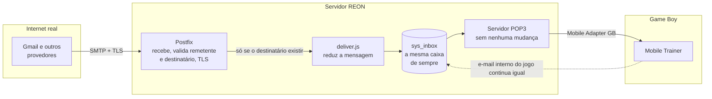

# Abrindo a caixa de correio do Game Boy para o mundo real

Como o servidor passou a aceitar e-mail de verdade (Gmail e afins) sem tocar
em uma linha do jogo e sem virar um relay aberto na internet.

- **Escopo:** entrada e saída (internet ↔ jogo)
- **Status:** em produção, testado com Gmail nos dois sentidos

## Contexto — o que já existia

Jogos como Pokémon Crystal usam o **Mobile Adapter GB** (o "modem" de 2001
que ligava o Game Boy na internet) para mandar e receber e-mail entre
jogadores, através do endereço interno `@reon.dion.ne.jp`. O REON sempre
implementou isso do zero: um servidor SMTP e um servidor POP3 escritos à
mão, falando só entre o jogo e o próprio banco de dados. Nunca existiu
ligação nenhuma com a internet de verdade — era um correio fechado, só para
dentro do próprio jogo.

Essa parte continua existindo exatamente como sempre foi. Nada do que vem a
seguir mexeu nela.

## O problema

A ideia era simples de descrever e nada trivial de fazer com segurança:
alguém manda um e-mail normal, do Gmail, para `jogador01@reon.dion.ne.jp`, e
essa mensagem aparece na caixa de entrada do jogo — sem quebrar o correio
interno, e sem transformar o servidor num relay aberto que qualquer
spammer da internet possa usar para mandar lixo por aí.

A peça que faltava era um MTA (servidor de e-mail) de verdade — o
hand-rolled SMTP não fala TLS, não entende corretamente todas as variações
do protocolo, e não foi feito para receber tráfego da internet aberta. A
resposta foi trazer o **Postfix**, que é o servidor de e-mail usado por boa
parte da internet, para assumir essa função.

## Arquitetura — como ficou



O Postfix passou a ouvir a porta 25 no lugar do servidor antigo. Toda
mensagem que chega de fora passa por ele — que verifica remetente, aplica
TLS, confere se o destinatário existe — e só então entrega para um pequeno
programa novo, o `deliver.js`, que grava a mensagem na mesma tabela que o
correio interno sempre usou. Do ponto de vista do servidor POP3 que o jogo
já conhece, nada mudou: ele lê a mesma caixa de sempre, não importa se a
mensagem veio de outro jogador ou de um e-mail real.

## Segurança — por que isso não vira um relay aberto

Um "relay aberto" é um servidor de e-mail que aceita mandar mensagens de
qualquer um para qualquer um — é exatamente o tipo de coisa que spammers
procuram, e que faz um servidor entrar em listas negras rapidamente. Para
evitar isso, o desenho ficou deliberadamente limitado:

- **Saída trancada por padrão.** O Postfix recusa encaminhar e-mail pra
  fora, a não ser que o dispositivo remetente esteja autorizado no momento
  (ver "Envio para a internet real" abaixo) — sem isso, é a mesma recusa de
  sempre.
- **Destinatário verificado antes de aceitar.** Antes de dizer "aceito essa
  mensagem" para quem está enviando, o Postfix confere no banco se aquele
  endereço existe de verdade. E-mail para conta inexistente é recusado na
  hora, não silenciosamente descartado depois.
- **Tamanho limitado.** Mensagens acima de 15 KB são recusadas antes mesmo
  de chegar ao jogo (mais sobre o porquê desse número abaixo).

> Mandar e-mail do jogo *para* a internet real (o caminho inverso) tinha um
> problema mais delicado: o protocolo do Mobile Adapter GB de 2001 não tem
> nenhum jeito nativo de provar quem está falando do outro lado. Isso foi
> resolvido reaproveitando a mesma autorização por dispositivo usada no
> login sem senha (ver seção mais abaixo) — só um dispositivo autorizado
> consegue mandar para um endereço de fora, e mesmo assim só passa pelo
> Brevo (um relay de terceiros já confiável), nunca entrega direto. Ver
> seção "Envio para a internet real" mais abaixo.

## Hardware de 2001 — o Game Boy não é um cliente de e-mail moderno

Antes de qualquer mensagem chegar ao jogo, ela passa por uma faxina. E-mail
de verdade vem cheio de coisa que o Mobile Trainer simplesmente não sabe o
que fazer com: HTML, anexos, imagens, assinaturas, rastreadores, cabeçalhos
técnicos. Nada disso existe no mundo do jogo — a fonte da ROM japonesa nem
tem acento, e a tela mal tem espaço para algumas linhas de texto puro.

Então o `deliver.js` e o servidor POP3 reduzem cada mensagem recebida ao
essencial:

- Extraem só a parte em texto puro do e-mail (quando ele tem várias
  versões, como é comum) — HTML e anexos ficam de fora.
- Convertem acentos e caracteres especiais para o equivalente sem acento,
  já que a fonte do jogo não tem esses glifos — *exceto* para mensagens que
  já chegam no formato japonês nativo (ISO-2022-JP), que ficam intocadas.
- Descartam cabeçalhos técnicos que só interessam a clientes de e-mail
  modernos, mantendo apenas remetente, destinatário e assunto.

Exemplo ilustrativo — HTML, imagem embutida e acentos saem, o essencial fica:

**Chega do Gmail:**

```
MIME-Version: 1.0
Content-Type: multipart/alternative;
 boundary="00000..."

--00000...
Content-Type: text/html;
 charset="UTF-8"

<div dir="ltr">Oi! Passando pra
avisar que a troca tá confirmada
pro sábado 👍<br><br>
</div>

--00000...
Content-Type: text/plain;
 charset="UTF-8"

Oi! Passando pra avisar que a
troca tá confirmada pro sábado 👍
```

**Chega no jogo:**

```
From: amigo@gmail.com
To: jogador01@reon.dion.ne.jp
Subject: troca de sabado
Content-Type: text/plain;
 charset=us-ascii

Oi! Passando pra avisar que a
troca ta confirmada pro sabado ?
```

## Produção — o que quebrou (e como foi resolvido)

Nada disso funcionou de primeira. Uma lista curta do que apareceu testando
no servidor real, sem entrar em detalhe técnico demais:

**01 — E-mail chegava truncado no jogo.**
O Postfix e o leitor de e-mail antigo usavam convenções diferentes de
quebra de linha internamente. *Corrigido* normalizando a quebra de linha no
momento da entrega.

**02 — O correio inteiro saiu do ar, inclusive o interno.**
Um caractere corrompido, de uma edição manual anterior, quebrou o processo
do servidor de e-mail por completo — e como o POP3 do jogo roda no mesmo
processo, caiu junto. *Corrigido* removendo o caractere. Fica o lembrete de
que a parte nova e a antiga ainda dividem o mesmo serviço.

**03 — A entrega de e-mail travava sem motivo aparente.**
Uma proteção de segurança do próprio sistema operacional (pensada contra
malware) por coincidência também impedia o motor do Node.js de compilar
código na hora. *Corrigido* rodando só esse programa de entrega num modo
mais simples, sem enfraquecer a proteção do resto do servidor.

**04 — Alguns e-mails reais travavam a leitura pelo jogo.**
Um bug de tipo de dado na parte que reduz a mensagem (tratava a mensagem
como texto quando na verdade era um formato binário). *Corrigido* e testado
com o formato de dado real que o banco entrega.

**05 — O limite de 15 KB não estava realmente ativo.**
Encontrado numa auditoria de rotina: o limite tinha sido planejado mas
nunca de fato aplicado no servidor — ele ainda aceitava o padrão de 10 MB.
*Corrigido* na hora e confirmado: e-mail de 20 KB é recusado, e-mail normal
passa.

**06 — Leitura de e-mail travava a sessão inteira, de forma intermitente e
sem erro nenhum no log.**
O ponto do servidor POP3 que busca o conteúdo de uma mensagem roda dentro
de um callback assíncrono do MySQL — se algo desse errado ali (por exemplo,
a mensagem ter sido apagada por outra sessão bem no meio da leitura), a
exceção não tinha como ser capturada por ninguém: a conexão simplesmente
ficava muda para sempre, sem responder e sem fechar, até o jogo estourar
por timeout. *Corrigido* adicionando tratamento de erro dentro do próprio
callback, confirmado em produção.

> Uma variante bem parecida do mesmo sintoma (leitura trava, sem erro
> nenhum) apareceu de novo em setembro/2026, mas dessa vez o servidor
> estava correto — o problema era do lado do próprio jogo (build GBDK):
> ao pedir a leitura de uma mensagem, ele só reservava espaço para uma
> resposta pequena, e o adaptador emulado descartava silenciosamente o
> resto quando a resposta era maior (o "." que marca o fim da mensagem
> ficava justamente na parte descartada). Achado com uma captura de
> pacotes direto no servidor, mostrando que a resposta tinha sido entregue
> por inteiro — corrigido do lado da ROM, não do reon-mail.

## Login sem repetir a senha real (XAPOP/XPROVISION)

Fora do bridge com a internet, uma segunda peça foi adicionada ao mesmo
servidor POP3: um jeito de o jogo entrar na caixa de correio sem mandar a
senha real de novo a cada sessão.

O motivo é uma limitação de como o adaptador emulado (libmobile) guarda
informação entre uma sessão e outra: ele não mantém a senha real digitada
no jogo — só na primeiríssima vez que conecta. Isso é bom para segurança
(a senha não fica espalhada em disco à toa), mas complica: como provar,
nas sessões seguintes, que é o mesmo dispositivo de sempre?

A solução reaproveita uma chave que **já existia** por outro motivo — a
mesma chave usada para autorizar o jogo a falar com a internet de verdade
(a chave em si já existe e é gerada no download do `config.bin`). Em vez de
mandar `USER`/`PASS` de novo, o jogo manda um comando novo, `XAPOP`,
provando que tem essa chave — sem nunca revelar a chave em si, só uma
assinatura calculada com ela. Se essa prova falhar por qualquer motivo
(chave revogada, conta nunca configurada assim), o jogo simplesmente cai
de volta no `USER`/`PASS` clássico, do jeito que sempre funcionou — nada
quebra.

- **Status:** implementado e testado de ponta a ponta (setembro/2026),
  servidor e jogo (Mobile Trainer e a ROM de testes MAGB TestSuite).
- Não muda nada para quem já usa o login clássico — é uma via alternativa,
  opcional, por cima do que já existia.

### O protocolo, em detalhe

`XAPOP` e `XPROVISION` **não existem** no RFC 1939 nem em nenhum registro de
extensão POP3. São nossos. Nada que se leia em outro lugar descreve esses
comandos, e nenhum cliente de e-mail pronto os implementa — então esta parte
é a especificação, para quem for reimplementar do lado do adaptador.

**1. O desafio vem na saudação.** O servidor sorteia 16 bytes novos a cada
conexão e coloca em hexadecimal na saudação, na mesma posição onde ficaria o
timestamp do APOP clássico:

```
+OK service ready 9609dd9ad231a61176f9cc876a0719ba@reon.dion.ne.jp
                  \______________________________/
                            o nonce
```

Ser novo a cada conexão é o que impede replay: uma assinatura capturada não
serve na sessão seguinte.

**2. O cliente responde com uma assinatura**, no estado AUTHORIZATION, no
lugar de `USER`/`PASS`:

```
XAPOP <ppp_id> <assinatura>
```

A assinatura tem 64 caracteres hexadecimais minúsculos e é calculada em dois
passos:

```
subchave   = HMAC-SHA256(chave = device_auth_key, mensagem = "pop3-xapop")
assinatura = HMAC-SHA256(chave = subchave,        mensagem = ppp_id + "|" + nonce)
```

O servidor valida o formato (`^g[0-9]{9}$` para o id, `^[0-9a-f]{64}$` para a
assinatura) **antes** de tocar no banco, busca a chave pelo `ppp_id`,
recalcula e compara em tempo constante.

**3. A subchave não é decoração.** Assinar direto com a `device_auth_key`
funcionaria — e estaria errado. A mesma chave também autentica o device-auth
do HTTP, que assina uma mensagem diferente com a chave **crua**:

```
HTTP:  HMAC-SHA256(chave = device_auth_key, mensagem = ppp_id + "|" + aparelho + "|" + acao + "|" + contador)
POP3:  HMAC-SHA256(chave = subchave,        mensagem = ppp_id + "|" + nonce)
```

Desde 09/09/2026 o contador do HTTP é **por aparelho**: `aparelho` são 8
bytes (16 hex) que identificam a implementação e a instalação — ver
"Um aparelho por vez" mais abaixo. A forma antiga, sem esse campo
(`ppp_id|acao|contador`), continua aceita como "aparelho sem identificação"
da conta.

Derivar uma subchave específica do POP3 garante que uma assinatura produzida
num protocolo nunca seja válida no outro, mesmo que algum dia os formatos de
mensagem colidam. Sem a derivação, os dois protocolos compartilham um oráculo
de assinatura.

**4. `XPROVISION` é o bootstrap.** Enviado no estado TRANSACTION — ou seja,
só *depois* de autenticar. Sem argumentos. Devolve a `device_auth_key` da
conta em 64 caracteres hex, criando uma se a conta ainda não tiver:

```
XPROVISION
+OK 3b1f...c7a2
```

O dispositivo autentica uma vez com `USER`/`PASS` de verdade, chama
`XPROVISION`, guarda a chave, e usa `XAPOP` em todas as sessões seguintes. A
senha cruza a rede exatamente uma vez, em vez de a cada sync.

`XPROVISION` deliberadamente **não** mexe em `counter`, `authorized` nem
`authorized_until` — esses campos pertencem ao device-auth do HTTP, que
libera o relay de saída, e provisionar uma chave de POP3 não pode conceder
nem revogar nada lá.

**5. Por que `USER`/`PASS` não pode ser desligado.** É o caminho de bootstrap:
um dispositivo sem chave não tem como chamar `XPROVISION` sem ele. E é também
o caminho de recuperação — quando uma chave é revogada, o `XAPOP` do
dispositivo passa a falhar, e cair no `USER`/`PASS` seguido de um
`XPROVISION` novo é o que permite ele se curar sozinho:

```
XAPOP        -> falha, chave revogada
USER / PASS  -> sucesso
XPROVISION   -> chave nova emitida
XAPOP        -> sucesso daqui em diante
```

Desligar `USER`/`PASS` deixaria um dispositivo revogado permanentemente sem
conseguir autenticar.

**Onde isso mora:** `mail/pop3Connection.js` (nonce, `XAPOP`, `XPROVISION`),
`web/classes/DeviceAuthUtil.php` (o lado HTTP da mesma chave), e a tabela
`sys_device_authorization`.

## Envio para a internet real

A peça que faltava — o jogo mandar e-mail *para* um endereço real, tipo
Gmail — também foi fechada. A ideia: só um dispositivo comprovadamente
autorizado consegue mandar pra fora, e mesmo assim a entrega passa por um
relay de terceiros já confiável (o Brevo, o mesmo que os e-mails do site
já usam) em vez do servidor tentar entregar direto — evita todo o trabalho
de reputação de domínio que entrega direta exigiria.

- **Quando o dispositivo fica autorizado:** na primeira vez que ele abre
  uma ligação de e-mail (SMTP ou POP3, o que vier primeiro) dentro da
  mesma chamada ao centro de mensagens do jogo. Continua autorizado até
  desligar a ligação, não até fechar aquela conexão específica — importante
  porque jogos reais (Mobile Trainer, Hello Kitty no Happy House) deixam o
  jogador ler e escrever e-mail livremente, indo e voltando, na mesma
  ligação.
- **O que o servidor faz com isso:** antes de aceitar repassar uma mensagem
  pra um endereço de fora, o Postfix pergunta pra um serviço novo
  (`reon-relay-policy`) se aquele remetente está autorizado agora. Só
  responde "sim" ou "não decido, segue a regra padrão" — nunca consegue
  *forçar* uma recusa, só afrouxar a regra padrão (que já recusa tudo por
  conta própria).
- **Status:** implementado e testado de ponta a ponta, incluindo um envio
  de verdade do jogo (Mobile Trainer) pra uma conta Gmail real, confirmado
  entregue pelo Brevo.

**07 — O e-mail de saída chegava vazio/quebrado (`554 Relay access denied`
primeiro, depois simplesmente não chegava).** Dois problemas empilhados,
achados nessa ordem:

Primeiro, o remetente que o jogo usa (`@reon.dion.ne.jp`) é um domínio
*real*, de uma operadora japonesa de verdade — sem controle de DNS sobre
ele, não tem como autenticar SPF/DKIM, e provedores como o Gmail recusam
silenciosamente. *Corrigido* reescrevendo o remetente, só na saída, para o
domínio que o REON realmente possui e já tem autenticado no Brevo.

Segundo, mesmo com o domínio certo, o formato exato do cabeçalho `From:`
que o jogo gera (documentado, real, usado por Mobile Trainer de verdade —
o nome do jogador codificado dentro de um comentário entre parênteses) não
é um formato tecnicamente válido, e provedores reais descartam silencio-
samente uma mensagem assim, sem nem devolver erro. *Corrigido* reescrevendo
só esse cabeçalho, só na saída, pro formato correto — sem tocar em nada do
lado do jogo, que continua recebendo o formato original de sempre.

> Achado numa investigação bem mais longa que o normal — a resposta "e-mail
> aceito" do Brevo (`250 OK`) não é garantia de entrega nenhuma. Só foi
> possível confirmar checando o painel do Brevo (que não tinha registro
> nenhum dessas mensagens, mesmo aceitas) e testando com contas reais.

**08 — O corpo da mensagem (texto em japonês) chegava corrompido, mesmo com
o cabeçalho já corrigido.** O Brevo reembala toda mensagem que passa por ele
no formato HTML dele próprio (rastreamento de abertura, link de descadastro
etc.), mas não decodifica o ISO-2022-JP do jogo antes de fazer isso — o
resultado era a sequência de escape aparecendo crua no texto (tipo
`$B#T#e#s#t#e(B` em vez de `Teste`).

*Corrigido* — mas não configurando o Brevo, e sim tirando esse trabalho das
mãos dele: em vez do Postfix entregar direto pro Brevo, a saída externa
agora passa por um programinha próprio (`outboundRelay.js`) que decodifica
o ISO-2022-JP do jogo pro texto de verdade (Unicode) *antes* do Brevo sequer
ver a mensagem — assim não importa o que o Brevo faça depois com o
reembalamento, o texto já chega correto. Testado de ponta a ponta com uma
mensagem real cobrindo o teclado inteiro do jogo (hiragana, katakana,
alfanumérico e símbolos) — chegou legível no Gmail.

De brinde, essa investigação achou (e corrigiu) mais duas coisas sem
relação direta com o texto em si: uma falha de segurança real numa
biblioteca usada para mandar e-mail (permitia, em tese, que o servidor
fosse induzido a ler arquivo local ou acessar endereço arbitrário só
processando o conteúdo da mensagem) — atualizada; e um caso, em outra
função do site (troca de Pokémon), onde o destinatário de um e-mail vinha
de um campo não validado enviado pelo próprio jogo — corrigido trocando
para sempre entregar pra conta que realmente fez a ação, sem depender
desse campo.

## Dois endereços, uma caixa

O cadastro passou a pedir um **usuário REON** de até 20 caracteres, e o
endereço de 8 caracteres que os jogos comportam é **derivado** dele em vez de
escolhido — a pessoa nunca precisa pensar no limite do adaptador. Quem chega
primeiro leva o nome; um segundo pedido pelo mesmo prefixo recebe dígitos no
fim.

As duas formas chegam na mesma caixa:

| forma | exemplo |
| --- | --- |
| completa, da internet | `playername@mail.reon.zsrv.com.br` |
| curta, do Game Boy | `playerna@reon.dion.ne.jp` |

A busca de destinatário aceita as duas, tanto no `deliver.js` (entrada pelo
Postfix) quanto no `smtpConnection.js` (SMTP do jogo). Ambas as colunas são
únicas, então uma consulta só resolve qualquer uma das formas sem risco de
acertar a conta errada.

> Isso ficou meses **prometido e não cumprido** sem ninguém notar: o código
> estava commitado, mas esses dois arquivos nunca tinham sido copiados para o
> servidor. Em produção, e-mail endereçado ao nome completo era recusado como
> destinatário desconhecido. Achado comparando checksum de cada arquivo
> versionado contra o que roda de fato — 66 dos 68 batiam, e os dois que não
> batiam eram exatamente esses.

## REON Mail — a caixa de correio pelo navegador

O correio do jogo passou a ter uma segunda porta: uma tela web para ler e
escrever, sem depender do Mobile Trainer. Ela lê a **mesma tabela** de sempre,
então o que chega pelo jogo aparece ali e vice-versa.

### O Mobile Trainer sempre apaga

Um teste no cliente real revelou uma coisa que muda o desenho: **o Mobile
Trainer não tem modo "deixar no servidor"**. Os três caminhos dele terminam em
exclusão — baixar e apagar, apagar sem baixar, e ler no servidor e apagar
manualmente. Um deles destrói mensagem que ninguém nunca leu.

Isso tem duas consequências:

- **Confirmação de leitura não é implementável.** O cliente nunca deixa nada
  para trás nem relata que leu. O que o servidor consegue observar é entrega:
  o jogo espia o cabeçalho com `TOP` antes de baixar com `RETR`, então marcar
  só no `RETR` separa "levou uma cópia" de "descartou sem ler".
- **O `DELE` virou lixeira.** Marca em vez de apagar, com purga automática
  depois de 30 dias. As duas consultas que montam o maildrop filtram o que
  está na lixeira — sem esse filtro o jogo rebaixaria a lixeira inteira a cada
  sincronização e a caixa nunca esvaziaria. Verificado no cliente real: cinco
  mensagens baixadas e apagadas, e a sessão seguinte não recebeu nada.

### O que o jogo consegue exibir

A tela web aceita texto livre, o Game Boy não. As mensagens são limitadas ao
que a tela dele comporta — **8 linhas de 12 caracteres** — e recusadas na
composição em vez de truncadas na entrega. O assunto entregue ao jogo é
cortado em 10 caracteres.

Os dois cortes contam **caracteres, não bytes**. Cortar por byte partiria um
caractere ISO-2022-JP ao meio e deixaria a sequência de escape pendurada, que
é exatamente o tipo de cabeçalho malformado contra o qual um parser de 2001
não tem defesa.

### Enviar para fora, sem afrouxar o portão do jogo

O relay de saída é liberado pela autorização de dispositivo, e quem usa o
webmail tem sessão web, não dispositivo. A saída não foi abrir o portão — foi
notar que ele guarda **outra porta**.

A política está em `smtpd_relay_restrictions`, ou seja, protege submissão por
SMTP, que é o caminho do jogo. O webmail submete localmente pelo `sendmail`,
que o Postfix roteia direto para o mesmo `outboundRelay.js`, com a mesma
reescrita de domínio. Caminho paralelo, portão do jogo intacto.

A autorização desse caminho é a sessão web, com o remetente lido da conta e
não do formulário — ninguém envia como outra pessoa. Vem com limite por hora
e registro de auditoria, porque isso abre um caminho para a internet a
qualquer conta registrada.

### Bugs encontrados construindo isso

- **Injeção de cabeçalho.** Uma quebra de linha no assunto virava cabeçalho de
  verdade: um `Bcc:` digitado na caixa de assunto seria honrado. No caminho
  interno já era ruim; com o externo ligado, seria um relay de spam. CR e LF
  agora saem de todo valor de cabeçalho.
- **Corrida no POP3.** O `+OK` da autenticação era enviado *fora* do callback
  que monta o maildrop, nos dois caminhos — XAPOP incluído. Cliente rápido
  recebia caixa vazia numa caixa cheia. O adaptador nunca tropeçava porque
  pausa entre comandos; um frontend de emulador tropeçaria.
- **Cabeçalho com acento chegava destruído.** O decodificador recebia o
  cabeçalho inteiro e substituía por `?` todo byte não-ASCII fora de um
  encoded-word — ou seja, todo e-mail externo com acento no assunto.

## Quem fala com esse servidor

O bridge só vale o que os adaptadores conseguem alcançar dele. São quatro
implementações independentes hoje, e o fato de serem independentes é o que
transforma cada uma em teste das outras — vários bugs desta lista foram
achados porque duas implementações discordavam.

| implementação | o que é | estado |
| --- | --- | --- |
| **libmobile** | o core, compartilhado | device-auth por aparelho, consulta assinada, bloqueio cooperativo, relay v1 (`b136972`) |
| **libmobile-bgb** | frontend para o emulador BGB | código de pareamento no terminal; `3fe18d9` |
| **PicoAdapterGB** | hardware de verdade (Pico W / Pico 2 W / ESP) | código de pareamento na web e no serial; seis `.uf2` Release (`30a1d42`) |
| **mGBA** | port para o emulador mGBA (PC e 3DS) | **fechado de ponta a ponta em 08/09/2026**; bloqueio verificado no 3DS em 09/09; release `9257-0ab45a2a0` |

O port do mGBA foi o último a fechar, e fechou em duas etapas no mesmo dia. A
primeira foi a **camada de adaptador**, verificada em hardware real (3DS)
depois de corrigir um bug de comparação de endereços. A segunda foi a cadeia
inteira, e ela só fechou depois de o servidor ter denunciado um bug que não
era dele.

### O dia em que o ciclo fechou

O primeiro teste de envio externo pelo 3DS deu `30-554` no jogo. O log do
servidor mostrou o porquê com precisão: **18 `deauthorize` e zero
`authorize`** num dia inteiro. Sem `authorize` a conta nunca ficava
autorizada, a política de relay respondia `DUNNO`, e o Postfix caía na regra
padrão — `554 Relay access denied`. O servidor agiu exatamente como projetado.

O defeito estava na libmobile, e o próprio 18/0 era a assinatura dele: o
`deauthorize` só é emitido se um `authorize` tiver sido gerado antes, então
cada um dos 18 provava que um `authorize` nascera e evaporara. O gate que
despachava os eventos exigia sessão ociosa, mas o `authorize` só nasce
*durante* a sessão — e o `deauthorize` do desligamento o sobrescrevia antes de
ele ter vez. Estrutural, não intermitente. Corrigido no core (`77b09e9`).

Com o binário novo, às 13:54:37 UTC, entrou o **primeiro `authorize` da
história desse servidor** — e cinco segundos depois o Postfix aceitou o que
antes recusava:

```
13:54:37  device-auth authorize c=201 -> 200        authorized=1
13:54:37  smtpd: connect from 177.144.120.157
13:54:40  BC41E7BAFB: client aceito                 política respondeu OK
13:54:42  to=<...@gmail.com> relay=reonoutbound status=sent
```

Mesmo remetente, mesmo destinatário, mesmo IP das quatro recusas de uma hora
antes. A única variável que mudou foi `authorized` passar de 0 para 1.

> Duas lições que valem mais que o dia. **E-mail funcionando não prova
> device-auth**: quem autentica a sessão POP3 é `USER`/`PASS` ou `XAPOP`, e o
> device-auth só governa o relay de *saída para endereços externos* — correio
> interno anda com ele inteiramente desligado. E **agregado sem atribuição
> engana**: todos os aparelhos daquela rede saem pelo mesmo IP e a libmobile
> não manda `User-Agent`; o que separou os dois clientes no log foi a
> continuidade do lote do contador (151, 152, 153, 154 → ciclo de energia →
> 201, 202), e nada mais.

### O que caiu no caminho, do lado do servidor

Fechar o ciclo expôs três defeitos nossos, cada um escondido atrás do
anterior.

**Bypass de autenticação no `doAuth(2)`.** O cache de 15 minutos da
autenticação de utility era indexado só pelo session id do PHP, derivado dos
**44 primeiros caracteres** do `Authorization` — que decodificam para o
desafio que o próprio servidor publicou, em texto puro, no seu 401. Durante a
janela inteira, a metade derivada da senha nunca era olhada. Reproduzido: os 44
caracteres certos com todo o resto trocado por `A` autenticavam com 200.
Achado pela suíte de testes, cujo estouro de buffer produziu um cabeçalho
truncado que autenticou mesmo assim. O cache agora exige o valor inteiro, em
comparação de tempo constante; um miss cai na validação completa, então o
reuso legítimo do cliente oficial continua servido.

**Revogação engolida como replay.** Contador igual ao último aceito devolvia
200 sem fazer nada, na leitura de que só podia ser retransmissão da mesma
chamada. Vale para `authorize`; não vale para `deauthorize`. Um aparelho que
reinicia no meio de um lote volta com o contador atrás do servidor e manda o
`deauthorize` justamente no número já guardado — e a revogação sumia, com o
aparelho seguindo autorizado e o cliente ouvindo 200. Visto em produção no
mesmo dia. Revogação é fail-safe, o pior que uma repetida faz é revogar o já
revogado; passou a ser honrada com contador igual. `authorize` continua
exigindo contador estritamente maior.

**Numeração do POP3 sem `ORDER BY`.** A consulta que monta a caixa não
ordenava, e a ordem das linhas vira o número da mensagem — que é o que `RETR` e
`DELE` endereçam. Saía em ordem de chegada por acaso do índice escolhido; se
o otimizador trocasse para `(recipient, read_at)`, abrir um e-mail no webmail
renumeraria a caixa que o jogo vê. Agora é explícito.

> Só o primeiro dos três era alcançável antes: os outros dois só aparecem
> quando o `authorize` despacha, e ele nunca tinha despachado. Consertar um
> bug foi o que deixou os seguintes visíveis.

### Armadilhas para quem for portar

> **`XAPOP` e `XPROVISION` não são trabalho do frontend.** Vivem inteiramente
> dentro da libmobile (`pop3_auth.c`), provisionamento da chave incluído — o
> frontend só carrega bytes pelo socket e nunca vê o HMAC. Uma falha de
> assinatura nunca é do mGBA, do BGB ou do PicoAdapterGB: é do core ou do
> servidor.
>
> **`mobile_addr_compare()` comparava padding de struct.** Em ARM o enum ocupa
> 1 byte, sobram 3 não inicializados, e o efeito era que *nenhuma* resolução
> de DNS funcionava. Achado no port para 3DS, medido pelo PicoAdapterGB no
> toolchain deles (não atingidos só porque as structs nasciam zeradas dos dois
> lados), corrigido no core comparando campo a campo.
>
> **O contador pula, por desenho.** Alvos embarcados reservam 50 valores por
> gravação para poupar a flash; um ciclo de energia retoma do teto, não do
> último usado. A garantia é "estritamente crescente, nunca repetido" — não
> continuidade. O servidor aceita qualquer salto para frente e foi escrito para
> essa garantia, não para a mais forte.

## Um aparelho por vez — identidade e bloqueio

A `config.bin` é baixada **uma vez** e é a mesma no PC, no 3DS, no Pico. Até
09/09/2026 o device-auth tinha um contador por *conta*, e o primeiro
aparelho a falar deixava o segundo para trás — o 3DS levava `403` até o lote
dele ultrapassar o do PC. O dono decidiu: "são aparelhos diferentes, não é
certo um atrapalhar o outro". Ficou assim, revisado com as quatro
implementações antes de qualquer uma implementar (regra dele: cada uma é
uma):

- **Identidade vem do aparelho, nunca da bin.** O core deriva
  `sha256(nome_da_implementacao || 0x00 || identidade)[:8]`: no 3DS e no Vita
  a identidade é o MAC do rádio, no Pico o id da placa, no PC o
  machine-id (ou equivalente) com hostname e usuário como piso — calculado
  ao iniciar e mantido só em memória. Nada disso vai para a `config.bin`,
  senão a cópia identificaria a bin, não o aparelho. O nome da implementação
  entra no hash para que mGBA e BGB no mesmo PC sejam dois aparelhos.
- **Código de pareamento** são os 8 primeiros hex do id, `A4A2-90F8`: o
  aparelho mostra na própria tela (mGBA), no terminal (BGB) ou na interface
  web/serial (Pico), e a página **Dispositivos conectados** da conta mostra
  o mesmo. Nunca se digita — serve para reconhecer, dar apelido e bloquear.
- **Contador por aparelho** em `sys_device_counter` (`user_id`, `device_id`,
  contador, autorização, apelido, bloqueio, último uso, IP). Até 32 por
  conta; linhas nunca são apagadas automaticamente (apagar reabriria replay
  de requisição capturada). "Revogar todos" gira a chave e mantém as linhas.
- **Consulta assinada ao abrir a sessão** (`action=query`): o aparelho gasta
  um valor do contador como nonce, assina `ppp_id|aparelho|query|nonce`, e o
  servidor responde `<contador> <nonce> <sig>` sobre
  `ppp_id|aparelho|query-response|contador|nonce`. Quem perdeu o estado local
  retoma de valor+1; um intermediário na rede do jogador não empurra o
  contador para o estouro (o Pico pegou isso na revisão). A primeira
  consulta válida cria a linha do aparelho, e cada consulta com nonce maior
  que o anterior carimba "último uso".
- **Bloqueio é cooperativo, e está dito com todas as letras.** O servidor só
  enxerga o aparelho no device-auth: POP3 e as páginas do jogo autenticam
  com a senha da conta que está na bin, o SMTP do jogo não autentica nada.
  Então bloquear responde `blocked <nonce> <sig>` à consulta, e o core da
  libmobile recusa DNS e TCP naquela sessão ("BLOCKED" na tela do jogo).
  Nunca persiste, e sem resposta segue aberto. Aparelho hostil ou perdido é
  senha nova + revogar todos. Verificado no 3DS do dono em 09/09/2026, sem
  reiniciar: bloqueio → consulta 702 "blocked", nada do jogo chegou;
  desbloqueio → consulta 703 normal, homepage baixou.
- **P2P pelo mobile-relay também bloqueia.** Uma sessão só de P2P nunca faz
  login no DION, logo nunca consulta, e o aparelho bloqueado seguia trocando
  e batalhando pelo relay. Handshake **versão 1**
  (`[1]"MOBILE" has_token token has_device aparelho(8)`): o relay escolhe o
  formato pelo byte de versão e ecoa o mesmo byte em toda resposta, consulta
  `sys_device_counter` **só leitura** (nunca cria linha), recusa o bloqueado
  com 1 byte de motivo antes de fechar (`0x01` token, `0x02` bloqueado). A
  versão 0 foi cortada em 09/09/2026 com as três releases publicadas. HMAC
  no handshake foi rejeitado: quem tem o aparelho tem a bin e a chave da
  conta. P2P direto, IP com IP, fica fora do alcance por construção.

> Armadilha para quem for portar: a identidade não pode ser cacheada quando
> a derivação falha. No 3DS o MAC só existe depois que a rede sobe; o core
> pergunta de novo a cada uso até ter resposta, e o frontend não precisa de
> retry.

## Onde estamos

- Recebimento de e-mail real (Gmail → jogo) está em produção, testado de
  ponta a ponta com tráfego real, TLS confirmado nos logs.
- Envio de e-mail real (jogo → Gmail) está em produção, gated por
  autorização do dispositivo, com cabeçalho, remetente e corpo (incluindo
  japonês) corrigidos e confirmados chegando de verdade, legíveis.
- Correio interno do jogo (jogador → jogador) continua funcionando
  exatamente como sempre funcionou, sem nenhum processamento — mensagem
  interna sempre chega intocada, byte a byte.
- Login sem repetir a senha (XAPOP) está pronto e testado nos dois lados.
- A cadeia inteira de device-auth — `authorize`, política de relay, entrega
  externa, `deauthorize` ao desligar — foi exercitada em produção em
  08/09/2026, com o portão decidindo de verdade pela primeira vez.
- REON Mail está em produção: ler, escrever (interno e externo, este último
  confirmado chegando no Gmail), lixeira de 30 dias com restaurar e apagar em
  lote. Os indicadores de e-mail — no menu da conta, dentro dele e no menu
  lateral — se atualizam sozinhos a cada minuto em qualquer página, com uma
  única consulta por página; o aviso de mensagem nova do webmail escuta a
  mesma consulta em vez de fazer outra.
- Todos os formulários do site exigem um token anti-CSRF preso à sessão, e o
  cookie de sessão sai com `SameSite=Lax`, `HttpOnly` e `Secure` (este quando a
  requisição veio por HTTPS). Os caminhos do jogo em `web/cgb` ficaram de
  fora de propósito: autenticam por cabeçalho, não por cookie.
- HTTP redireciona para HTTPS — **só para navegador no host humano**. A porta
  80 é compartilhada com os hosts do jogo, que não fala TLS e não segue 301,
  então `/cgb/`, `/api/`, o conteúdo `/NN/`, a renovação do certificado em
  `/.well-known/` e qualquer requisição sem cabeçalho `Host` (HTTP/1.0, como
  o adaptador manda) ficam em HTTP. Testado caso a caso, inclusive HTTP/1.0
  sem `Host`.
- E-mails de conta que não saem deixaram de fingir que saíram. O envio
  devolvia "enviado" mesmo quando o relay recusava, e o cadastro e a troca de
  e-mail mostram agora um aviso; a redefinição de senha segue muda por
  desenho, para não revelar se o endereço existe, e registra só no log. O que
  tornou isso possível foi outro achado: **`error_log()` não ia a lugar
  nenhum** — o pool do PHP-FPM descartava a saída dos workers, então toda
  chamada de log no código era um no-op. Agora cai em
  `/var/log/reon/php-error.log`.
- Device-auth **por aparelho**: a mesma `config.bin` em qualquer par de
  aparelhos sem um atrapalhar o outro; página **Dispositivos conectados** com
  código de pareamento, apelido, último uso e bloqueio por aparelho;
  bloqueio cooperativo verificado no 3DS e estendido ao P2P pelo
  mobile-relay (handshake v1, versão 0 cortada). Ver "Um aparelho por vez".
- Fuso horário da conta em identificadores (`Asia/Tokyo` por padrão, o de
  Tóquio, onde o serviço original vivia), em vez do `+0900` cru.
- Páginas **Get started** e **Downloads** no site, e os hubs de jogo como
  mini-sites de uma página: texto em Markdown em `web/pages/`, editável
  sem tocar em PHP.
- Nenhuma alteração foi feita — nem está prevista — na ROM do jogo.

---
*reon · reon-mail (postfix + deliver.js) · setembro 2026*
