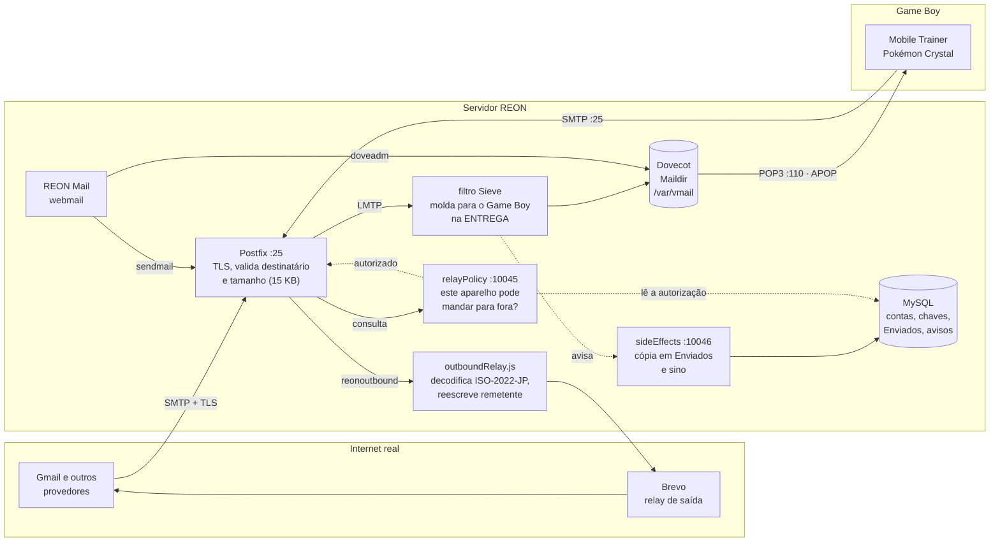

> Convertido do [artifact do Claude](https://claude.ai/code/artifact/e54c85bd-5416-41ba-afbd-d1cafcf1991e) em 07/10/2026. Versão original em português; [English — principal](GAME_BOY_MAIL_MEMO.md).
> Preserva a revisão original, incluindo afirmações históricas e perguntas abertas. Não constitui nova auditoria da produção ou das exigências legais. Veja [OPERATIONS](../OPERATIONS.md), [CHANGELOG](../CHANGELOG.md) e [NET_DE_GET](../NET_DE_GET.md) para mudanças posteriores do projeto.
> Identificadores pessoais de contas nos exemplos foram substituídos por valores fictícios em 2026-10-07; a estrutura do protocolo foi preservada.

## Como ler junto da documentação atual

**Conferido em 07/10/2026.** A narrativa e a antiga lista final foram atualizadas em momentos diferentes
no artifact. A lista duplicada foi retirada deste Memo; a narrativa mantém
afirmações históricas identificadas abaixo. Use o changelog do repositório para o resumo de mudanças mantido e
[OPERATIONS.md](../OPERATIONS.md) para as configurações operacionais.

- O dono pode limpar notificações; as não removidas expiram em 365 dias.
  Os trechos “não tem botão de excluir” e “o sistema não apaga” são históricos.
- A auditoria não permite editar nem excluir linhas pelo painel; o expurgo
  automático, porém, remove as linhas após 365 dias.
- A caixa de entrada está no Dovecot/Maildir, lida por `MailStoreUtil`, e não
  na antiga tabela MySQL. Enviados ainda usa `sys_sent`; “MySQL só guarda
  contas” era simplificação excessiva também presente no changelog, agora corrigida.
- Brevo identifica o fornecedor usado naquela investigação. O relay de saída
  é configurável; esse nome não é dependência obrigatória da arquitetura.
- A descrição de GitHub como espelho antecede a mudança do remote `home` da
  REON para GitHub, pedida pelo dono. As instruções do repositório indicam o destino atual.
- A implementação de Net de Get em outubro, seu painel e o valor histórico
  sem cobrança estão documentados em [NET_DE_GET.md](../NET_DE_GET.md) e no changelog.

Veja as [notas da comparação](README.md#consistency-review-2026-10-07) e suas fontes.
Abaixo permanece a narrativa original; o changelog duplicado foi retirado.

---

REON — memo interno

# Abrindo a caixa de correio do Game Boy para o mundo real

Como o servidor passou a aceitar e-mail de verdade (Gmail e afins) sem tocar em uma linha do jogo e sem virar um relay aberto na internet.

**Escopo:** correio (internet ↔ jogo), autenticação por aparelho, painel

**Status:** em produção, testado com Gmail nos dois sentidos

Contexto

## O que já existia

Jogos como Pokémon Crystal usam o **Mobile Adapter GB** (o "modem" de 2001 que ligava o Game Boy na internet) para mandar e receber e-mail entre jogadores, através do endereço interno `@reon.dion.ne.jp`. O REON sempre implementou isso do zero: um servidor SMTP e um servidor POP3 escritos à mão, falando só entre o jogo e o próprio banco de dados. Nunca existiu ligação nenhuma com a internet de verdade — era um correio fechado, só para dentro do próprio jogo.

Essa parte continua existindo exatamente como sempre foi. Nada do que vem a seguir mexeu nela.

O problema

## Dava para receber e-mail de fora?

A ideia era simples de descrever e nada trivial de fazer com segurança: alguém manda um e-mail normal, do Gmail, para `jogador01@reon.dion.ne.jp`, e essa mensagem aparece na caixa de entrada do jogo — sem quebrar o correio interno, e sem transformar o servidor num relay aberto que qualquer spammer da internet possa usar para mandar lixo por aí.

A peça que faltava era um MTA (servidor de e-mail) de verdade — o hand-rolled SMTP não fala TLS, não entende corretamente todas as variações do protocolo, e não foi feito para receber tráfego da internet aberta. A resposta foi trazer o **Postfix**, que é o servidor de e-mail usado por boa parte da internet, para assumir essa função.

Arquitetura

## Como ficou



Uma caixa só, dois leitores: o cartucho pela porta 110 e o webmail pelo lado de dentro.

O Postfix atende a porta 25 e é a única porta de entrada: valida TLS, confere no banco se o destinatário existe e recusa acima de 15 KB antes de aceitar. O que ele aceita vai por LMTP para o Dovecot, e no caminho passa por um filtro que molda a mensagem para o que a fonte do Game Boy consegue mostrar — **na entrega**, e não na leitura, porque o Dovecot serve os bytes guardados e não tem gancho de leitura.

A mesma caixa é lida por dois lados, e é isso que faz o correio do jogo e o do site serem o mesmo correio: o cartucho disca a porta 110, que hoje é do Dovecot e autentica por APOP; o webmail lê pelo lado de dentro, sem passar por POP3 nenhum. O MySQL deixou de guardar correspondência — sobrou com as contas, as chaves dos aparelhos, a pasta Enviados e os avisos do sino.

A saída para a internet é o caminho de baixo no desenho, e é o único que tem porteiro: antes de aceitar repassar para fora, o Postfix pergunta ao `relayPolicy` se aquele aparelho está autorizado naquele instante. Autorizado, a mensagem vai para o `outboundRelay.js`, que decodifica o japonês do jogo e reescreve o remetente antes de entregar ao Brevo.

Segurança

## Por que isso não vira um relay aberto

Um "relay aberto" é um servidor de e-mail que aceita mandar mensagens de qualquer um para qualquer um — é exatamente o tipo de coisa que spammers procuram, e que faz um servidor entrar em listas negras rapidamente. Para evitar isso, o desenho ficou deliberadamente limitado:

- **Saída trancada por padrão.** O Postfix recusa encaminhar e-mail para fora, a não ser que o dispositivo remetente esteja autorizado no momento (ver "Envio para a internet real" abaixo) — sem isso, é a mesma recusa de sempre.

- **Destinatário verificado antes de aceitar.** Antes de dizer "aceito essa mensagem" para quem está enviando, o Postfix confere no banco se aquele endereço existe de verdade. E-mail para conta inexistente é recusado na hora, não silenciosamente descartado depois.

- **Tamanho limitado.** Mensagens acima de 15 KB são recusadas antes mesmo de chegar ao jogo (mais sobre o porquê desse número abaixo).

Mandar e-mail do jogo *para* a internet real (o caminho inverso) tinha um problema mais delicado: o protocolo do Mobile Adapter GB de 2001 não tem nenhum jeito nativo de provar quem está falando do outro lado. Isso foi resolvido reaproveitando a mesma autorização por dispositivo usada no login sem senha (ver seção mais abaixo) — só um dispositivo autorizado consegue mandar para um endereço de fora, e mesmo assim só passa pelo Brevo (um relay de terceiros já confiável), nunca entrega direto. Ver seção "Envio para a internet real" mais abaixo.

Hardware de 2001

## O Game Boy não é um cliente de e-mail moderno

Antes de qualquer mensagem chegar ao jogo, ela passa por uma faxina. E-mail de verdade vem cheio de coisa que o Mobile Trainer simplesmente não sabe o que fazer com: HTML, anexos, imagens, assinaturas, rastreadores, cabeçalhos técnicos. Nada disso existe no mundo do jogo — a fonte da ROM japonesa nem tem acento, e a tela mal tem espaço para algumas linhas de texto puro.

Então o filtro de entrega reduz cada mensagem recebida ao essencial (isso morava no `deliver.js` e no nosso POP3; hoje é um filtro que o Dovecot chama quando a carta chega):

- Extraem só a parte em texto puro do e-mail (quando ele tem várias versões, como é comum) — HTML e anexos ficam de fora.

- Convertem acentos e caracteres especiais para o equivalente sem acento, já que a fonte do jogo não tem esses glifos — *exceto* para mensagens que já chegam no formato japonês nativo (ISO-2022-JP), que ficam intocadas.

- Descartam cabeçalhos técnicos que só interessam a clientes de e-mail modernos, mantendo apenas remetente, destinatário e assunto.

#### Chega do Gmail

```text
MIME-Version: 1.0
Content-Type: multipart/alternative;
 boundary="00000..."

--00000...
Content-Type: text/html;
 charset="UTF-8"

<div dir="ltr">Oi! Passando pra
avisar que a troca tá confirmada
pro sábado 👍<br><br>
</div>

--00000...
Content-Type: text/plain;
 charset="UTF-8"

Oi! Passando pra avisar que a
troca tá confirmada pro sábado 👍
```

#### Chega no jogo

```text
From: amigo@gmail.com
To: jogador01@reon.dion.ne.jp
Subject: troca de sabado
Content-Type: text/plain;
 charset=us-ascii

Oi! Passando pra avisar que a
troca ta confirmada pro sabado ?
```

Exemplo ilustrativo — HTML, imagem embutida e acentos saem; o essencial fica.

Produção

## O que quebrou (e como foi resolvido)

Nada disso funcionou de primeira. Uma lista curta do que apareceu testando no servidor real, sem entrar em detalhe técnico demais:

01

### E-mail chegava truncado no jogo

O Postfix e o leitor de e-mail antigo usavam convenções diferentes de quebra de linha internamente.

Corrigido normalizando a quebra de linha no momento da entrega.02

### O correio inteiro saiu do ar — inclusive o interno

Um caractere corrompido, de uma edição manual anterior, quebrou o processo do servidor de e-mail por completo — e como o POP3 do jogo roda no mesmo processo, caiu junto.

Corrigido removendo o caractere. Fica o lembrete de que a parte nova e a antiga ainda dividem o mesmo serviço.03

### A entrega de e-mail travava sem motivo aparente

Uma proteção de segurança do próprio sistema operacional (pensada contra malware) por coincidência também impedia o motor do Node.js de compilar código na hora.

Corrigido rodando só esse programa de entrega num modo mais simples, sem enfraquecer a proteção do resto do servidor.04

### Alguns e-mails reais travavam a leitura pelo jogo

Um bug de tipo de dado na parte que reduz a mensagem (tratava a mensagem como texto quando na verdade era um formato binário).

Corrigido e testado com o formato de dado real que o banco entrega.05

### O limite de 15 KB não estava realmente ativo

Encontrado numa auditoria de rotina: o limite tinha sido planejado mas nunca de fato aplicado no servidor — ele ainda aceitava o padrão de 10 MB.

Corrigido na hora e confirmado: e-mail de 20 KB é recusado, e-mail normal passa.06

### Leitura de e-mail travava a sessão inteira, sem erro nenhum no log

O ponto do servidor POP3 que busca o conteúdo de uma mensagem roda dentro de um callback assíncrono do MySQL — se algo desse errado ali (ex: a mensagem apagada por outra sessão no meio da leitura), a exceção não tinha como ser capturada por ninguém: a conexão ficava muda para sempre, sem responder e sem fechar.

Corrigido com tratamento de erro dentro do próprio callback, confirmado em produção.

Uma variante bem parecida do mesmo sintoma (leitura trava, sem erro nenhum) apareceu de novo em setembro/2026 — mas dessa vez o servidor estava correto. O problema era do lado do próprio jogo (build GBDK): ao pedir a leitura de uma mensagem, ele só reservava espaço para uma resposta pequena, e o adaptador emulado descartava silenciosamente o resto quando a resposta era maior — o "." que marca o fim da mensagem ficava justamente na parte descartada. Achado com uma captura de pacotes direto no servidor (mostrando que a resposta tinha sido entregue por inteiro) e corrigido do lado da ROM, não do reon-mail.

Autenticação

## Login sem repetir a senha real (APOP)

Fora do bridge com a internet, há uma segunda peça: um jeito de o jogo entrar na caixa de correio sem mandar a senha real de novo a cada sessão.

O motivo é uma limitação de como o adaptador emulado (libmobile) guarda informação entre uma sessão e outra: ele não mantém a senha real digitada no jogo — só na primeiríssima vez que conecta. Isso é bom para segurança (a senha não fica espalhada em disco à toa), mas complica: como provar, nas sessões seguintes, que é o mesmo dispositivo de sempre?

A solução reaproveita uma chave que **já existia** por outro motivo — a mesma usada para autorizar o jogo a falar com a internet de verdade, entregue ao aparelho dentro do `mobile_config.bin`. O adaptador prova que a tem sem nunca revelá-la, mandando só um resumo calculado com ela.

**O que o servidor faz é configuração, não código.** O APOP é do RFC 1939 e o Dovecot já o implementa: ele sorteia o desafio, anuncia o mecanismo e confere o resumo contra a consulta que a gente escreve. Não há comando nosso no caminho, e é isso que permitiu desligar o nosso servidor POP3.

### O protocolo, em detalhe

Nada aqui é invenção nossa — é APOP padrão. O que é nosso são as *escolhas*: qual segredo entra na conta, e com que nome o aparelho se apresenta. As duas erram fácil, e as duas já custaram tempo aqui.

1. #### O desafio vem na saudação


  O Dovecot gera um por conexão e o coloca entre `<` e `>` no fim da saudação.

   +OK Dovecot ready. <75396.1.6aa57397.yPUY/1vnHDGb3SdJkYc/uA==@servidor> \______________________________________________________/ o desafio, COM os sinais

  Os `<>` fazem parte do que entra no MD5. Tirá-los é o erro clássico, e dá um resumo que nunca casa.

2. #### O cliente responde com o resumo


  No estado AUTHORIZATION, no lugar de `USER`/`PASS`. São 32 caracteres hexadecimais minúsculos.

   APOP <nome> <resumo> resumo = MD5(desafio + segredo)

3. #### O segredo é a chave em hexadecimal, não os bytes crus


  A `device_auth_key` tem 32 bytes. O que entra no MD5 são os **64 caracteres hexadecimais minúsculos** que a representam, em ASCII — não os 32 bytes binários.

   errado: MD5(desafio + bytes_crus) 32 bytes certo: MD5(desafio + "3b1f...c7a2") 64 chars ASCII

  O MD5 aqui não é fraqueza: o que ele protege é um segredo de 256 bits, então um resumo capturado não se quebra por força bruta. É a mesma construção que o caminho HTTP do jogo já usa — `md5(desafio + senha)` — só que ali a senha tem oito caracteres, porque quem calcula é o cartucho. Aqui quem calcula é o adaptador, e é por isso que cabe um segredo desse tamanho.

4. #### O nome do login é o gID, não o nome da caixa


  Uma conta tem três nomes, e este é o ponto em que eles se confundem. O aparelho se apresenta com o **gID** (`g` mais nove dígitos), que é o que o `mobile_config.bin` leva e o que o PPP já usava. A caixa tem outro nome, legível, e nas contas de hoje os dois **nunca** coincidem.

   APOP g000000002 <resumo> -> +OK (gID, o que o cartucho manda) APOP nintendo <resumo> -> +OK (nome da caixa, aceito também)

  A consulta de autenticação aceita os dois e devolve *sempre* o nome da caixa, e é esse valor que faz a entrega achar `/var/vmail/<caixa>`. Sem essa tradução, um login por gID autenticaria e abriria uma caixa vazia chamada `g000000002` — falha pior que a recusa, porque parece funcionar.

5. #### Não há porta dos fundos


  `USER`/`PASS` está desligado. O interruptor existe no painel de administração e mora no banco, e não no arquivo de configuração, para ligar e desligar sem recarregar nada — mas está fechado por decisão do dono.

   com o degrau fechado, a consulta devolve '*' como senha, que não casa com nada: a senha CERTA também é recusada.

  Quem administra abre e fecha esse degrau, e a decisão não fica presa no código.

**Onde isso mora:** `examples/dovecot/99-reon.conf` (a consulta de autenticação, que é o único código nosso nesse caminho) e a tabela `sys_device_authorization`. Do lado do aparelho, `build_apop()` no core da libmobile.

Migração

## A caixa mudou de casa

Durante meses a correspondência do REON morava numa tabela do banco, e o servidor POP3 era nosso, escrito em JavaScript. Funcionava. O problema apareceu quando se olhou para onde isso ia dar: o pessoal do REONTeam guarda e-mail em Postfix mais Dovecot, e a intenção é que o nosso código acabe rodando no servidor deles. Uma tabela de banco não roda lá. Era a peça que travava tudo.

Em 12/09/2026 a caixa mudou de casa. O Postfix entrega por LMTP, o Dovecot guarda em Maildir, e o MySQL voltou a ser só o cadastro de contas. A porta 110 — a que o Game Boy disca — passou a ser atendida pelo Dovecot.

**O ponto inteiro do trabalho foi não perder nada no caminho.** O que era nosso e o jogo dependia mudou de casa em vez de sumir, e cada peça foi conferida por soma de verificação contra o que o jogo recebia antes.

As **tratativas** — limpar o envelope do Postfix, reduzir mensagem de fora para o que a fonte do Mobile Trainer consegue mostrar — saíram da leitura e foram para a entrega, num filtro que o Dovecot chama quando a carta chega. Não é código parecido com o de antes: é literalmente o mesmo arquivo, chamado de outro lugar. Foi isso que permitiu provar que o jogo recebe os mesmos bytes.

O **DELE** continua não destruindo. O Mobile Trainer não tem modo "deixar no servidor" — todos os caminhos dele apagam, e um deles apaga sem ter baixado. O Dovecot tem uma opção nativa para isso: marca em vez de remover, esconde das sessões seguintes, e a mensagem continua recuperável pelo site.

Três coisas quebraram no caminho e só apareceram porque foram procuradas. A cópia em *Enviados* e a linha no sino moravam dentro do agente de entrega que saiu do caminho — correspondência chegava e não avisava ninguém. A rotina que esvazia a lixeira continuava olhando a tabela vazia, rodando todo dia sem expurgar nada. E a correspondência que já estava guardada não passava pelo filtro novo, então teria chegado crua ao Game Boy, com todo o envelope do Postfix dentro.

Mudar de casa cobrou um preço que só apareceu depois, e vale registrar porque é a mesma causa em três sintomas diferentes: **passou a existir uma cópia só de cada mensagem, servindo dois leitores de necessidades opostas**. O cartucho quer pouco byte e título curto; o webmail quer a carta inteira. Enquanto a moldagem acontecia na leitura, cada um via o que precisava. Feita na entrega, ela grava o resultado — e o webmail passou a mostrar o título cortado em 10 caracteres e a perder o fio das respostas, porque `In-Reply-To` era podado junto. A saída foi o que o webmail precisa viajar em cabeçalho próprio, ao lado do curto. O custo foi medido: troca do Trade Corner, carta entre jogadores e carta de fora com título curto saem byte por byte iguais ao que saíam; só carta de fora com título longo cresce, 38 bytes.

Dois outros vieram do mesmo lugar. A cópia em *Enviados* passou a ser gravada **duas vezes** em toda carta entre jogadores, porque o carimbo que diz "o webmail já arquivou isto sozinho" estava na lista do que a moldagem remove — e quem lê esse carimbo só via a mensagem depois de moldada. E o login do cartucho ficou **quebrado**: a consulta de autenticação que escrevi aceitava só o nome da caixa, quando o aparelho se identifica pelo gID, que é outro campo e nunca coincide com aquele. Esse último não apareceu em teste nenhum nosso — apareceu porque a sessão que cuida do adaptador perguntou se os dois campos eram a mesma coisa, em vez de presumir. Seria descoberto no teste de hardware.

Saída para a internet

## Envio para a internet real

A peça que faltava — o jogo mandar e-mail *para* um endereço real, tipo Gmail — também foi fechada. A ideia: só um dispositivo comprovadamente autorizado consegue mandar pra fora, e mesmo assim a entrega passa por um relay de terceiros já confiável (o Brevo, o mesmo que os e-mails do site já usam) em vez do servidor tentar entregar direto — evita todo o trabalho de reputação de domínio que entrega direta exigiria.

- **Quando o dispositivo fica autorizado:** na primeira vez que ele abre uma ligação de e-mail (SMTP ou POP3, o que vier primeiro) dentro da mesma chamada ao centro de mensagens do jogo. Continua autorizado até desligar a ligação, não até fechar aquela conexão específica — importante porque jogos reais (Mobile Trainer, Hello Kitty no Happy House) deixam o jogador ler e escrever e-mail livremente, indo e voltando, na mesma ligação.

- **O que o servidor faz com isso:** antes de aceitar repassar uma mensagem pra um endereço de fora, o Postfix pergunta pra um serviço novo (`reon-relay-policy`) se aquele remetente está autorizado agora. Só responde "sim" ou "não decido, segue a regra padrão" — nunca consegue *forçar* uma recusa, só afrouxar a regra padrão (que já recusa tudo por conta própria).

**Status:** implementado e testado de ponta a ponta, incluindo um envio de verdade do jogo (Mobile Trainer) pra uma conta Gmail real, confirmado entregue pelo Brevo.

07

### O e-mail de saída não chegava — dois problemas empilhados

Primeiro: o remetente que o jogo usa (`@reon.dion.ne.jp`) é um domínio *real*, de uma operadora japonesa de verdade — sem controle de DNS, sem como autenticar SPF/DKIM, recusado silenciosamente pelo Gmail. Segundo: mesmo com o domínio certo, o formato exato do cabeçalho `From:` que o jogo gera (documentado, real, usado por Mobile Trainer de verdade — nome do jogador num comentário entre parênteses) não é tecnicamente válido, e provedores reais descartam a mensagem sem nem devolver erro.

Corrigido reescrevendo remetente e cabeçalho, só na saída — o jogo continua recebendo/mandando o formato original de sempre, sem nenhuma mudança do lado dele.

Achado numa investigação mais longa que o normal — a resposta "e-mail aceito" do Brevo (`250 OK`) não é garantia de entrega nenhuma. Só foi possível confirmar checando o painel do Brevo (sem registro nenhum dessas mensagens, mesmo aceitas) e testando com contas reais.

08

### O corpo da mensagem (texto em japonês) chegava corrompido, mesmo com o cabeçalho já corrigido

O Brevo reembala toda mensagem que passa por ele no formato HTML dele próprio (rastreamento de abertura, link de descadastro etc.), mas não decodifica o ISO-2022-JP do jogo antes de fazer isso — o resultado era a sequência de escape aparecendo crua no texto (tipo `$B#T#e#s#t#e(B` em vez de `Teste`).

Corrigido — não configurando o Brevo, e sim tirando esse trabalho das mãos dele: a saída externa agora passa por um programinha próprio (outboundRelay.js) que decodifica o ISO-2022-JP do jogo pro texto de verdade antes do Brevo sequer ver a mensagem. Testado de ponta a ponta com uma mensagem real cobrindo o teclado inteiro do jogo (hiragana, katakana, alfanumérico e símbolos) — chegou legível no Gmail.

De brinde, essa investigação achou (e corrigiu) mais duas coisas sem relação direta com o texto em si: uma falha de segurança real numa biblioteca usada para mandar e-mail (permitia, em tese, induzir o servidor a ler arquivo local ou acessar endereço arbitrário só processando o conteúdo da mensagem) — atualizada; e um caso, em outra função do site (troca de Pokémon), onde o destinatário de um e-mail vinha de um campo não validado enviado pelo próprio jogo — corrigido entregando sempre pra conta que realmente fez a ação, sem depender desse campo.

Endereços

## Dois endereços, uma caixa

O cadastro passou a pedir um **usuário REON** de até 20 caracteres, e o endereço de 8 caracteres que os jogos comportam é *derivado* dele em vez de escolhido — a pessoa nunca precisa pensar no limite do adaptador. Quem chega primeiro leva o nome; um segundo pedido pelo mesmo prefixo recebe dígitos no fim.

#### Da internet

```text
exampleplayer@mail.reon.zsrv.com.br
```

#### Do Game Boy

```text
examplep@reon.dion.ne.jp
```

As duas formas chegam na mesma caixa.

A busca de destinatário aceita as duas — hoje no mapa que o próprio Postfix consulta, no lugar do `deliver.js` e do `smtpConnection.js` que faziam isso quando o correio era nosso. As duas colunas são únicas, então uma consulta só resolve qualquer uma das formas sem risco de acertar a conta errada.

Isso ficou **prometido e não cumprido** sem ninguém notar: o código estava commitado, mas esses dois arquivos nunca tinham sido copiados para o servidor. Em produção, e-mail endereçado ao nome completo era recusado como destinatário desconhecido. Achado comparando checksum de cada arquivo versionado contra o que roda de fato — 66 dos 68 batiam, e os dois que não batiam eram exatamente esses.

12

### A forma anunciada como principal nunca recebeu

O quadro acima diz "as duas formas chegam na mesma caixa", e o da esquerda é o nome de conta. Em produção ele devolvia `550 User unknown in virtual mailbox table` a quem respondesse — o mapa de destinatários do Postfix conhece uma coluna só, a do nome da caixa. Pior: o correio que *saía* ia assinado com esse endereço, de modo que o serviço assinava cartas com um endereço que ele mesmo não sabia ler. A página da conta mostra essa forma num campo destacado, e o e-mail de boas-vindas a repete — todo usuário foi informado de um endereço que não funcionava.

Corrigido com um apelido que traduz o nome de conta no nome da caixa mantendo o domínio, para a carta cair na caixa que já existe em vez de abrir uma segunda; e o que sai passou a ser assinado com o endereço que recebe. Conferido antes de ligar que nenhum nome de conta colide com o nome de caixa de outra pessoa, o que faria o apelido sequestrar correspondência alheia. Sondado depois: as duas formas respondem 250, e endereço inexistente continua em 550.

Webmail

## REON Mail — a caixa pelo navegador

O correio do jogo ganhou uma segunda porta: uma tela web para ler e escrever, sem depender do Mobile Trainer. Ela lê a **mesma tabela** de sempre, então o que chega pelo jogo aparece ali e vice-versa.

### O Mobile Trainer sempre apaga

Um teste no cliente real revelou algo que mudou o desenho: **não existe modo "deixar no servidor"**. Os três caminhos do Mobile Trainer terminam em exclusão — baixar e apagar, apagar sem baixar, e ler no servidor e apagar manualmente. Um deles destrói mensagem que ninguém nunca leu.

- **Confirmação de leitura não é implementável.** O cliente nunca deixa nada para trás nem relata que leu. O que dá para observar é entrega: o jogo espia o cabeçalho com `TOP` antes de baixar com `RETR`, então marcar só no `RETR` separa "levou uma cópia" de "descartou sem ler".

- **O `DELE` virou lixeira.** Marca em vez de apagar, com purga automática após 30 dias. As consultas que montam a caixa filtram o que está na lixeira — sem esse filtro o jogo rebaixaria a lixeira inteira a cada sincronização e a caixa nunca esvaziaria.

Verificado no cliente real: cinco mensagens baixadas e apagadas numa sessão, e a sessão seguinte não recebeu nada de volta.

### O que o jogo consegue exibir

A tela web aceita texto livre, o Game Boy não. As mensagens ficam limitadas ao que a tela dele comporta — **8 linhas de 12 caracteres** — recusadas na composição em vez de truncadas na entrega, e o assunto fica em 10 caracteres pela mesma razão.

Os dois totais **não são limites independentes**, e por um tempo foram tratados como se fossem. Uma única linha de 96 caracteres cabia nos dois — é uma linha, são 96 caracteres — e mesmo assim ocupava as oito fileiras da tela sozinha, jogando fora tudo o que viesse depois. A contagem que vale é a de linhas *depois da quebra*. A caixa de composição quebra enquanto se digita, e trocar para um jogador depois de escrever solto pergunta antes de reformatar e cortar.

Os dois cortes contam **caracteres, não bytes**. Cortar por byte partiria um caractere ISO-2022-JP ao meio e deixaria a sequência de escape pendurada — exatamente o tipo de cabeçalho malformado contra o qual um parser de 2001 não tem defesa.

### Correspondência de jogo sai da web

Com a regra do par de cabeçalhos conhecida, o webmail separou as duas naturezas. A primeira tentativa deu à correspondência de jogo uma aba própria, só para consulta. Durou pouco, e a razão de ter caído é melhor que a de ter existido: **o jogador não tem nada a fazer com ela**. O corpo é carga binária de um cartucho, não há o que ler, e um contador de cartas que ninguém pode abrir é pergunta sem resposta.

Então ela foi para os bastidores. Continua sendo e-mail de verdade na caixa e no POP3 — o cartucho depende disso para funcionar — mas some por completo da web: fora da caixa de entrada, fora da lixeira, sem aba, sem contador, sem tela de leitura. O `?id=` de uma dessas responde igual a mensagem de outra pessoa, e a recusa mora no SQL, porque esconder um botão não é restrição — apagar um resultado de troca tiraria o Pokémon do cartucho que ainda vai buscá-lo.

O que um jogo *fez* chega ao jogador por outro caminho, que é o assunto da seção do sino, mais abaixo.

### Enviar para fora, sem afrouxar o portão do jogo

O relay de saída é liberado pela autorização de dispositivo, e quem usa o webmail tem sessão web, não dispositivo. A saída não foi abrir o portão — foi notar que ele guarda *outra porta*.

A política está em `smtpd_relay_restrictions`, ou seja, protege a submissão por SMTP, que é o caminho do jogo. O webmail submete localmente pelo `sendmail`, que o Postfix roteia direto para o mesmo `outboundRelay.js`, com a mesma reescrita de domínio. Caminho paralelo; o portão do jogo continua tão restrito quanto era.

A autorização desse caminho é a sessão web, com o remetente lido da conta e não do formulário — ninguém envia como outra pessoa. Vem com limite por hora e registro de auditoria, porque isso abre um caminho para a internet a qualquer conta registrada.

### Bugs encontrados construindo isso

09

### Injeção de cabeçalho pelo campo de assunto

Uma quebra de linha no assunto virava cabeçalho de verdade — um `Bcc:` digitado ali seria honrado. No caminho interno já era ruim; com o envio externo ligado, seria um relay de spam.

Corrigido removendo CR e LF de todo valor de cabeçalho, testado pelos dois vetores (assunto e destinatário).10

### Caixa cheia respondendo "nenhuma mensagem"

O `+OK` da autenticação era enviado *fora* do callback que monta a lista de mensagens, em todos os caminhos de login. Cliente rápido recebia caixa vazia. O adaptador nunca tropeçava porque pausa entre comandos; um frontend de emulador tropeçaria.

Corrigido movendo a resposta para dentro do callback, testado com cliente sem pausa nenhuma.11

### Assunto com acento chegava destruído

O decodificador recebia o cabeçalho inteiro e substituía por `?` todo byte não-ASCII fora de um encoded-word — ou seja, todo e-mail externo com acento no assunto ou no nome do remetente.

Corrigido decodificando apenas os encoded-words e deixando o texto literal intacto.

Trade Corner

## A troca que nunca fechava

Por semanas o Trade Corner do Pokémon Crystal não concluía uma troca sequer. O jogador depositava, o servidor casava com outro pedido, o e-mail de resultado chegava na caixa — e o jogo consumia esse e-mail e dizia que ninguém tinha trocado. A suspeita passou pela ROM, pelo adaptador, pelo formato do e-mail e pelo remetente, nessa ordem. Todas erradas.

A culpa era nossa, e estava na faxina descrita lá em cima. A redução remonta toda mensagem a partir de uma lista de cabeçalhos permitidos antes de o Game Boy recebê-la — é ela que impede o ruído de servidor de e-mail real de custar segundos de cabo serial. Hoje isso roda na entrega (`slimMessage`, em `mail/gameFormat.js`, chamado pelo filtro do Dovecot); na época rodava na leitura, no nosso POP3. A lista tinha `x-game-title` e `x-game-code`, mas **não tinha `x-game-result`**, que é exatamente de onde o Crystal lê o desfecho da troca. O jogo recebia uma mensagem bem formada, sem o único campo que importava, e a descartava calado.

### Como isso foi provado

A análise estática dizia que estava tudo certo: os bytes de espécie e gênero conferiam, o valor tinha o tamanho exato que o jogo exige, os espaços estavam nas posições certas. O que resolveu foi um *dump de memória* com o jogo parado num breakpoint dentro da rotina de decodificação.

> x/1 0xd880 24 0x0000D880: 43 47 42 2D 42 58 54 45 2D 30 30 0D FF FF FF FF C G B - B X T E - 0 0 \r

Esse endereço é onde a rotina copia o valor do cabeçalho que acabou de procurar. Ele ainda continha `CGB-BXTE-00`, que é o valor do cabeçalho *anterior*. Ou seja: a segunda busca nunca copiou nada, e as comparações de espécie e gênero nunca chegaram a rodar. Nenhuma leitura de código teria mostrado isso — só a memória em execução mostrou.

### A regra que saiu daí

A mensagem crua é o que entra no banco, e **na entrega só a correspondência externa pode ser tratada**. Mensagem interna foi escrita para estes jogos e já está no formato que eles interpretam, então é entregue byte a byte. O `Date:` continua sendo acrescentado nos dois casos, porque nenhuma mensagem gravada traz um — a regra é sobre nunca *remover* nada de mensagem interna.

O corte de assunto em 10 caracteres morava dentro dessa mesma faxina, então mudou de lugar: virou regra de **composição no webmail**, onde passa a valer sempre que o destinatário é um jogador. Um jogo nunca escreve título maior, logo o webmail é o único caminho por onde um título grande poderia aparecer.

### A segunda vítima

Uma sonda controlada no mesmo dia revelou algo que ninguém sabia: o **Mobile Trainer se comporta como cliente de e-mail comum**, com uma única particularidade — ele deixa em paz o que está marcado como exclusivo de um jogo. Quatro mensagens foram colocadas na caixa e o Trainer sincronizou uma vez:

#### O que ele fez com cada uma

```text
X-Game-code + X-GBmail-type   -> deixou no servidor
X-Game-code, sem o tipo       -> BAIXOU e apagou
sem o code, so o tipo         -> BAIXOU e apagou
o codigo DELE MESMO + tipo    -> deixou no servidor
```

A regra é o par de cabeçalhos, e nenhum deles sozinho.

Não é "esse e-mail é meu": ele pulou até a sonda que levava o código do próprio Mobile Trainer. O par significa "isto é correspondência binária de um jogo, não uma carta de uma pessoa". E o filtro roda sobre os cabeçalhos do `TOP`, *antes* do `RETR` — ele nem gasta o tempo de serial baixando o corpo do que não é dele.

Aí está a segunda vítima do mesmo defeito: como o `x-gbmail-type` também estava sendo removido, o resultado de troca chegava ao Trainer com o código do jogo mas *sem* o tipo — exatamente a linha que ele **baixa e apaga**. Além de impedir o Crystal de concluir a troca, a faxina fazia o Mobile Trainer comer o e-mail da troca sempre que sincronizasse primeiro.

### Clonagem

Guardar cópia restaurável de uma troca concluída é um caminho para receber o mesmo Pokémon duas vezes. Então correspondência de jogo que o jogo *de fato coletou* passou a ser apagada de vez, em vez de ir para a lixeira. Só quando `retrieved_at` está preenchido, para que um jogo que apaga sem baixar continue com a rede de proteção da lixeira, e carta de gente vá sempre para a lixeira, não importa qual cliente apagou.

O dono descreveu a regra por cliente — "se o Mobile Trainer baixar, lixeira; se o Pokémon baixar, apaga direto". O servidor não enxerga qual cliente está conectado, então ela foi implementada pela natureza da mensagem, o que dá no mesmo porque as duas populações não se cruzam: o Trainer ignora correspondência de jogo, e os jogos só buscam a deles.

**Fechado ao vivo em 10/09/2026:** depósito real do dono, casamento pelo cron, e-mail entregue com o `X-Game-result` íntegro, breakpoint parando no caminho de sucesso da ROM, `RETR` baixando o corpo e o Growlithe entrando no jogo.

Um aparelho por vez

## Identidade por aparelho e bloqueio

A `mobile_config.bin` é baixada **uma vez** e é a mesma no PC, no 3DS, no Pico. Até 09/09/2026 o device-auth tinha um contador por *conta*, e o primeiro aparelho a falar deixava o segundo para trás — o 3DS levava `403` até o lote dele ultrapassar o do PC. A decisão do dono: "são aparelhos diferentes, não é certo um atrapalhar o outro". Revisado com as quatro implementações antes de qualquer uma implementar.

- **Identidade vem do aparelho, nunca da bin.** O core deriva `sha256(implementação || 0x00 || identidade)[:8]`: MAC do rádio no 3DS e no Vita, id da placa no Pico, machine-id (ou equivalente) no PC — calculado ao iniciar e mantido só em memória. **Uma exceção:** no core do RetroArch não há de onde derivar — nada na API libretro é estável —, então ali são 16 bytes sorteados e guardados num arquivo ao lado da bin. É o único caso em que a identidade não vem do aparelho, e o único que pede cuidado com cópia: o arquivo perdido faz o aparelho virar outro, e copiado para uma segunda máquina faz as duas virarem o mesmo aparelho, dividindo um contador. Nada vai para a `mobile_config.bin`, senão a cópia identificaria a bin, não o aparelho; o nome da implementação no hash faz mGBA e BGB no mesmo PC serem dois aparelhos.

- **Código de pareamento** — os 8 primeiros hex do id, `8E22-AF2E`. O aparelho mostra na própria tela, terminal ou interface web, e a página **Dispositivos conectados** da conta mostra o mesmo. Nunca se digita: serve para reconhecer, dar apelido e bloquear. Ter código de pareamento não prova ter chave de correio, e as três implementações passaram a dizer isso: um aparelho sem chave avisa, em vez de mostrar um código de aparência pronta e só falhar depois, na primeira busca de correio.

- **Contador por aparelho** em `sys_device_counter`, até 32 por conta; linhas nunca são apagadas automaticamente (apagar reabriria replay de requisição capturada). "Revogar todos" gira a chave e mantém as linhas. A primeira consulta válida cria a linha, e cada consulta com nonce maior carimba "último uso".

- **Bloqueio cooperativo, dito com todas as letras.** O servidor só enxerga o aparelho no device-auth — POP3 e as páginas do jogo autenticam com a senha da conta que está na bin, o SMTP do jogo não autentica nada. Bloquear responde `blocked` à consulta e o core da libmobile recusa DNS e TCP naquela sessão ("BLOCKED" na tela). Nunca persiste; sem resposta, segue aberto. Aparelho hostil ou perdido é senha nova + revogar todos.

- **P2P pelo mobile-relay também bloqueia.** Uma sessão só de P2P nunca faz login, logo nunca consulta; o bloqueado seguia trocando pelo relay. Handshake **v1** leva o id do aparelho; o relay consulta a tabela só em leitura, recusa o bloqueado com um byte de motivo, e a versão 0 foi cortada em 09/09/2026 com as três releases publicadas. HMAC no handshake não ajudaria: quem tem o aparelho tem a bin e a chave da conta. P2P direto, IP com IP, fica fora por construção.

**Verificado no 3DS do dono em 09/09/2026, sem reiniciar:** bloqueio no site → consulta 702 respondida "blocked", nada do jogo chegou ao servidor; desbloqueio → consulta 703 normal, homepage baixou.

Armadilha para quem for portar: a identidade não pode ser cacheada quando a derivação falha. No 3DS o MAC só existe depois que a rede sobe; o core pergunta de novo a cada uso até ter resposta, e o frontend não precisa de retry.

Painel

## Uma sala de máquinas para o REON

O que era uma tela de notícias virou um painel: contas, serviços, logs, notificações, as páginas que o Game Boy vê e um criador de edições da Pokémon News. Três decisões o sustentam, e as três são sobre o que *não* fazer.

### Uma porta só, e nada sem registro

Todo handler sob `/admin` chama a mesma guarda, antes de ler qualquer coisa do pedido, e responde **404** em vez de 403 — um 403 confirma que a página existe. Painel em que cada página decide por si é painel em que uma delas um dia decide diferente.

E tudo que um administrador faz cai numa tabela só de acréscimo: quem, o quê, o alvo e de qual endereço. Não existe update nem delete para ela em lugar nenhum — a mesma razão pela qual o histórico de notificações também não tem exclusão.

### O sino, e um histórico que não se apaga

Tudo que acontece com um jogador e não é carta — troca concluída, depósito que ninguém apareceu para fazer, aviso escrito à mão — passou a ter lugar: um sino ao lado do nome da conta. Sem novidade é só o ícone; com novidade a bolinha numerada pisca em roxo, cor que não é usada em mais nada, para o laranja continuar querendo dizer uma coisa só: há carta para ler.

A caixinha do sino mostra **só o que não foi lido**. O que já foi vive na página de histórico e em mais lugar nenhum — é uma bandeja do que é novo, não uma segunda cópia do histórico. E o dono da notificação não tem botão de excluir: uma notificação é o registro de que algo aconteceu, e registro que se apaga não é registro.

O texto é guardado como **chave de tradução mais parâmetros**, não como frase pronta. O site fala sete idiomas e o cron que grava a linha não fala nenhum, então as palavras são escolhidas na hora de ler. Só o que uma pessoa digitou é gravado literalmente — traduzir as palavras de alguém não cabe a nós.

No Trade Corner isso fechou um buraco antigo: troca concluída e depósito que expirou sem par geram notificação *e* e-mail para o endereço real do cadastro. Depositar é justamente ir embora; resultado que só se descobre voltando para conferir é meio resultado. Os avisos saem depois do commit da transação, nunca de dentro dela — linha de notificação volta atrás num rollback, e-mail que já saiu não volta.

### Banimento que alcança o console

A conta banida é recusada no login, no device-auth, no POP3 e na política de relay externo. Um ban que deixa a caixa de e-mail acessível não é um ban, é uma porta trancada com a janela aberta. O login devolve a mesma resposta de senha errada — dizer "a senha estava certa, mas a conta está banida" é dizer a um atacante que a senha estava certa. Banir um administrador é recusado, e banir a conta em uso também: painel capaz de trancar o próprio operador para fora tranca, uma hora.

### Serviços, e uma permissão que foi dividida em duas

Os serviços contínuos ligam, desligam e reiniciam pelo painel — menos o nginx, que só reinicia. Desligá-lo de uma página servida por ele é porta de mão única: o botão que o ligaria de volta cai junto. O auxiliar privilegiado recusa isso também, não só o botão, porque regra que só existe na interface é regra que a primeira requisição feita à mão contorna.

As tarefas agendadas têm rodar agora, ativar, desativar e **trocar o horário**. O horário novo vai para um drop-in do systemd, nunca para a unit: neste servidor os arquivos de unit são links simbólicos para dentro do checkout, então editá-los seria editar o repositório. A expressão passa pelo `systemd-analyze calendar` antes de qualquer escrita — um `OnCalendar` inválido faria a tarefa nunca mais rodar, em silêncio.

Ler log e reiniciar serviço eram a mesma permissão, e não deveriam ser. Os dois passavam pelo auxiliar, então quem quisesse só ver log tinha de conceder sudo para reinícios junto — riscos muito diferentes tratados como um. Ler o journal precisa apenas de participar de um grupo, que dá leitura e nada mais.

### As páginas que o Game Boy vê

O Mobile Trainer busca páginas HTML do servidor, e agora elas se criam e se editam pelo painel, com o preview ao lado enquanto se digita: a tela do Game Boy de verdade, 160×144 em 2×, com a fonte do próprio Trainer no tamanho dela. O tamanho é o ponto — é o que diz ao autor que a linha não cabe, coisa que nenhuma descrição do limite faz tão bem.

Duas armadilhas que o preview de um navegador ensinaria errado, e que a documentação do adaptador esclareceu: `<b>` deixa o texto **vermelho**, não negrito, e `<center>` só funciona dentro de `<html>`. Nada é recusado por estar fora da lista de tags, porque a doc não diz o que o adaptador faz com uma tag desconhecida — recusar uma que funciona seria o erro pior.

### Quando a documentação perde para a realidade

O envio de imagem valida o cabeçalho BMP, não a extensão. As regras vieram da documentação: 1BPP, no máximo 144×96, sem tabela de cores. Aí o dono subiu as páginas do servidor de testes de verdade — 137 páginas, 37 imagens — e a regra **recusou 34 delas**. Imagens que um console renderiza hoje.

#### O que a doc diz

```text
1BPP
no máximo 144×96
sem tabela de cores
```

recusa 34 de 37 reais

#### O que as imagens reais são

```text
1BPP  (todas as 37)
até 144×208 e 12×244
biClrUsed = 2
```

o que todas respeitam: 8 bits

Duas partes da regra não se sustentam, e uma se sustenta. O limite que todas respeitam é o de 8 bits, que a doc também menciona; a tabela de duas cores é simplesmente o que um bitmap de duas cores tem. Manter a doc contra a evidência seria repetir o erro das tags: recusar o que comprovadamente funciona é o pior dos dois erros disponíveis.

12

### O validador achou uma imagem quebrada no servidor de testes

O `images/banner.bmp` de lá é **4BPP**, e o `credits/index.html` aponta para ele. O adaptador só desenha 1BPP, então essa página mostra imagem quebrada num console de verdade. A versão correta, 1BPP 144×33, está na pasta das editáveis — alguém copiou a errada.

Reportado ao dono; é conteúdo do servidor de testes deles, não nosso para arrumar.

### Criador de Pokémon News

Uma edição da Pokémon News não é um documento: é um **programa que o jogo interpreta**, montado a partir de fonte rgbds. A pista estava no nosso próprio código — o detector de rankings procura pelo byte `0x23`, que é `setval`.

Então a ferramenta de verdade (`pokecrystal-news-maker`) entra como submódulo, em vez de reimplementada. Um codificador escrito à mão para um formato do qual temos sete amostras seria palpite fantasiado de recurso. As sete edições históricas compartilham um esqueleto de ~600 linhas — menus, scripts de botão, tabelas de ranking, minigame — e diferem em quatro coisas, que são exatamente as que o painel deixa mexer:

- **Título e artigo, por idioma.** Texto simples vira as macros da caixa de diálogo: linha em branco começa parágrafo, a primeira linha abre a caixa, a segunda fica embaixo, o resto rola.

- **Três categorias de ranking**, com o nome que o jogo imprime. O consultor apurou que esse rótulo *nunca esteve na ROM* — o cartucho só conta números, o nome bonito era composto pelo serviço da Nintendo — mas está na ferramenta. São "BATTLE TOWER WINS", não `BATTLE_TOWER_WINS`.

- **Um minigame**, pelo nome que ele declara para si mesmo: "RAP IT UP!", "TALL OR SHORT?", "EASY POKéMON MAZE".

- **A linha da caixa de correio**, escrita nos caracteres do próprio jogo — `POKéMON NEWS No.1` são 14 bytes, não 17, porque alguns valem por mais de um caractere.

Sai o par `.bin` + `.bin.message` onde o agendador já procura, mais a entrada de calendário — que é o que de fato faz a edição chegar a alguém, e é ela que a classifica como custom. Um botão de retirada tira do calendário e apaga o compilado, nessa ordem: entrada sem arquivo é aviso diário no log, arquivo sem entrada é só disco ocupado.

O calendário das edições do painel mora num arquivo **separado**, mesclado pelo agendador. O config ao lado guarda também o agendamento das notícias comuns, e deixar uma aplicação web escrever lá deixaria a notícia de sempre a um save ruim de parar. Ser dono de um arquivo menor significa que uma escrita malformada só custa a trilha por que o painel responde.

Nada disso precisa de privilégio: o montador roda como o usuário web, num diretório temporário próprio, com lista de argumentos em vez de string de shell, e alcança a ferramenta só pelo caminho de includes.

Três defeitos meus, e os três foram pegos por máquina, não por leitura. Duas substituições largas demais — a do título trocava todas as trinta sequências `lang X, db` do arquivo, a do corpo engolia 280 linhas — que o *linker* denunciou como símbolo indefinido; se fossem um pouco menos largas teriam produzido um binário quebrado em silêncio. E um clássico do PHP: chave de array que parece número vira inteiro, então o caractere "1" virou a chave inteira 1 e a comparação estrita nunca casava — todo dígito era reportado como impossível de codificar, estando ali na tabela.

Onde estamos

## Status atual

- Recebimento de e-mail real (Gmail → jogo) está em produção, testado de ponta a ponta com tráfego real, TLS confirmado nos logs.

- Envio de e-mail real (jogo → Gmail) também está em produção, gated por autorização do dispositivo, com cabeçalho, remetente e corpo (incluindo japonês) corrigidos e confirmados chegando legíveis.

- Correio interno do jogo (jogador → jogador) continua funcionando exatamente como sempre funcionou, sem nenhum processamento — mensagem interna sempre chega intocada, byte a byte.

- **O Trade Corner conclui trocas.** Fechado ao vivo em 10/09/2026 com depósito real, casamento pelo cron e o Pokémon entrando no jogo — o que nunca tinha acontecido, porque a entrega removia o cabeçalho que carrega o resultado.

- **A caixa mora no Dovecot, e a porta 110 é dele.** Desde 12/09/2026 o Postfix entrega por LMTP e o Dovecot guarda em Maildir; o MySQL voltou a ser só o cadastro de contas. As tratativas do Game Boy passaram para a hora da entrega e foram conferidas por soma — o jogo recebe os mesmos bytes de antes.

- **Login sem repetir a senha, por APOP**, padrão do protocolo, com uma chave de 256 bits — o servidor não precisa de comando nenhum nosso para servi-lo. O nome de login é o gID do aparelho, o mesmo que o `mobile_config.bin` leva e que o PPP já usava — a caixa tem outro nome, e são campos que nunca coincidem. **Provado contra o servidor de produção em 12/09/2026**, por uma implementação de adaptador e não por teste nosso: autenticação aceita, `STAT` e `LIST` coerentes, `RETR` completo, e os corpos conferidos por soma contra o que foi enviado.

- REON Mail está em produção: ler, escrever (interno e externo, este último confirmado chegando no Gmail), lixeira de 30 dias com restaurar e apagar em lote, e aviso de mensagem nova sem recarregar a página. A conversa deixou de ser adivinhada pelo título: quem escreve diz, no envio, se responde algo ou abre assunto novo, e o fio de quem vem da internet é o `In-Reply-To`. Correspondência de jogo saiu da web por completo — continua no POP3, onde o cartucho precisa dela.

- **Painel de administração** em `/admin`: contas com banimento que alcança o console, notificações com histórico que o sistema não apaga (só o dono da linha, por um botão na página), serviços com liga/desliga e reagendamento, logs, o editor das páginas que o Game Boy vê e o criador de edições da Pokémon News. Uma guarda só, e registro de tudo que um administrador faz.

- **Quatro adaptadores** falam com esse servidor: libmobile (core), libmobile-bgb, PicoAdapterGB e mGBA — este último fechado de ponta a ponta em hardware real (3DS) em 08/09/2026 — o dia em que o portão de device-auth decidiu de verdade pela primeira vez. Serem independentes é o que faz cada um servir de teste aos outros: vários bugs desta página apareceram porque duas implementações discordavam.

- Device-auth **por aparelho**, página Dispositivos conectados, bloqueio cooperativo verificado no 3DS e estendido ao P2P pelo mobile-relay (o handshake v1 é o único aceito). As quatro implementações usam o mesmo core.

- Site: páginas **Get started** e **Downloads**, hubs de jogo como mini-sites de uma página, texto em Markdown em `web/pages/`; fuso da conta em identificadores (`Asia/Tokyo` por padrão).

- Os dois minijogos da Pokémon News que não montavam foram corrigidos no nosso fork do `pokecrystal-news-maker` (o submódulo): os dez minijogos montam nos seis idiomas, e o painel oferece o prêmio de cada um.

- Nenhuma alteração foi feita — nem está prevista — na ROM do jogo.

## Histórico de mudanças

O histórico de mudanças do projeto fica somente em [CHANGELOG.md](../CHANGELOG.md).
A lista duplicada do artifact original foi removida em 07/10/2026,
conforme pedido do dono.
