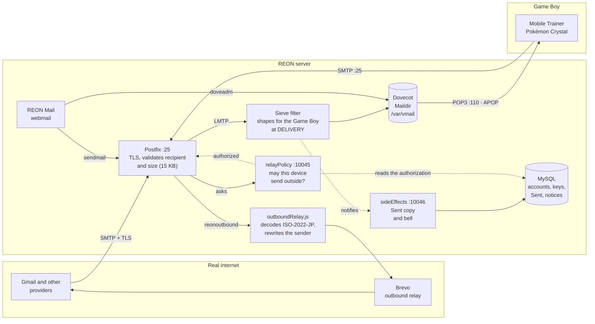

> Converted from the [Claude artifact](https://claude.ai/code/artifact/e54c85bd-5416-41ba-afbd-d1cafcf1991e) on 2026-10-07. Original English version; [Português (Brasil)](GAME_BOY_MAIL_MEMO.Br.md).
> This preserves the source revision, including historical statements and unresolved questions. It is not a fresh audit of production or legal requirements. See [OPERATIONS](../OPERATIONS.md), [CHANGELOG](../CHANGELOG.md), and [NET_DE_GET](../NET_DE_GET.md) for subsequent project changes.

## Reading this alongside current documentation

**Reconciled on 2026-10-07.** The narrative and former final change list were updated at different times
in the original artifact. The duplicate list has been removed from this Memo;
the narrative still contains historical statements identified below. Use the repository changelog for the maintained change summary and
[OPERATIONS.md](../OPERATIONS.md) for operational settings.

- Notifications can be cleared by their owner; uncleared rows expire after
  365 days. The earlier “no delete button” and “never erases” passages are historical.
- Administrative audit rows cannot be edited or deleted through the panel;
  the retention job nevertheless expires them after 365 days.
- The inbox is stored by Dovecot/Maildir and read through `MailStoreUtil`, not
  the old MySQL inbox table. Sent copies still use `sys_sent`; “MySQL only
  keeps accounts” was an oversimplification also present in the changelog, now corrected.
- Brevo describes the provider used in the recorded investigation. The outbound
  relay is configurable; that name is not a required architecture dependency.
- The GitHub mirror description predates the owner's change of REON's `home`
  remote to GitHub. See the repository instructions for the current push target.
- Net de Get's October implementation, admin panel and historical price
  metadata without billing are documented in [NET_DE_GET.md](../NET_DE_GET.md)
  and the changelog.

See the [comparison notes](README.md#consistency-review-2026-10-07) for evidence.
The original narrative follows; the duplicate changelog has been removed.

---

REON — internal memo

# Opening the Game Boy's mailbox to the real world

How the server started accepting real email (Gmail and the like) without touching a single line of the game, and without turning into an open relay on the internet.

**Scope:** mail (internet ↔ game), per-device auth, the admin panel

**Status:** in production, tested with Gmail in both directions

Context

## What already existed

Games like Pokémon Crystal use the **Mobile Adapter GB** (the 2001 "modem" that connected the Game Boy to the internet) to send and receive email between players, through the internal address `@reon.dion.ne.jp`. REON always implemented this from scratch: a hand-written SMTP server and POP3 server, talking only between the game and its own database. There was never any connection to the real internet — it was a closed mailbox, only for inside the game itself.

That part still exists exactly as it always did. Nothing below touched it.

The problem

## Could it receive email from outside?

The idea was simple to describe and anything but trivial to do safely: someone sends a normal email, from Gmail, to `player01@reon.dion.ne.jp`, and that message shows up in the game's inbox — without breaking internal mail, and without turning the server into an open relay any spammer on the internet could use to send junk.

The missing piece was a real MTA (mail server) — the hand-rolled SMTP doesn't speak TLS, doesn't correctly understand every variation of the protocol, and was never built to receive traffic from the open internet. The answer was bringing in **Postfix**, the mail server that runs a good chunk of the internet, to take over that job.

Architecture

## How it ended up



One mailbox, two readers: the cartridge through port 110, the webmail from the inside.

Postfix answers port 25 and is the only way in: it validates TLS, checks in the database that the recipient exists, and refuses anything over 15 KB before accepting it. What it accepts goes to Dovecot over LMTP, and on the way through a filter shapes the message down to what the Game Boy's font can show — **at delivery**, not at read time, because Dovecot serves the stored bytes and has no read hook.

The same mailbox is read from two sides, and that is what makes the game's mail and the site's mail the same mail: the cartridge dials port 110, which is Dovecot's now and authenticates over APOP; the webmail reads from the inside, through no POP3 at all. MySQL no longer holds correspondence — it kept the accounts, the device keys, the Sent folder and the bell notices.

Going out to the internet is the lower path in the diagram, and it is the only one with a gatekeeper: before agreeing to relay anything outward, Postfix asks `relayPolicy` whether that device is authorized at that moment. If it is, the message goes to `outboundRelay.js`, which decodes the game's Japanese and rewrites the sender before handing it to Brevo.

Security

## Why this doesn't turn into an open relay

An "open relay" is a mail server that accepts sending messages from anyone to anyone — exactly what spammers look for, and what gets a server blacklisted fast. To avoid that, the design was deliberately limited:

- **Outbound locked by default.** Postfix refuses to forward email outward unless the sending device is currently authorized (see "Sending to the real internet" below) — without that, it's the same refusal as always.

- **Recipient verified before accepting.** Before saying "I accept this message" to whoever's sending, Postfix checks the database to see whether that address really exists. Email to a nonexistent account is refused on the spot, not silently dropped afterward.

- **Size limited.** Messages over 15 KB are refused before they even reach the game (more on why that number, below).

Sending email from the game *to* the real internet (the reverse direction) had a trickier problem: the 2001 Mobile Adapter GB protocol has no native way to prove who's on the other end. This was solved by reusing the same per-device authorization used for password-free login (see the section further below) — only an authorized device can send to an outside address, and even then delivery only goes through Brevo (an already-trusted third-party relay), never delivered directly. See "Sending to the real internet" further below.

2001 hardware

## The Game Boy isn't a modern email client

Before any message reaches the game, it goes through a cleanup. Real email comes packed with things Mobile Trainer simply doesn't know what to do with: HTML, attachments, images, signatures, trackers, technical headers. None of that exists in the game's world — the Japanese ROM font doesn't even have accents, and the screen barely has room for a few lines of plain text.

So the delivery filter reduces every incoming message to the essentials (this lived in `deliver.js` and in our POP3; today it is a filter Dovecot calls when the letter arrives):

- Extract only the plain-text part of the email (when it has several versions, as is common) — HTML and attachments are left out.

- Convert accents and special characters to their accent-free equivalent, since the game's font has no such glyphs — *except* for messages that already arrive in native Japanese format (ISO-2022-JP), which are left untouched.

- Drop technical headers that only matter to modern email clients, keeping only sender, recipient, and subject.

#### Arrives from Gmail

```text
MIME-Version: 1.0
Content-Type: multipart/alternative;
 boundary="00000..."

--00000...
Content-Type: text/html;
 charset="UTF-8"

<div dir="ltr">Hi! Just letting you
know the trade's confirmed
for saturday 👍<br><br>
</div>

--00000...
Content-Type: text/plain;
 charset="UTF-8"

Hi! Just letting you know the
trade's confirmed for saturday 👍
```

#### Arrives on the game

```text
From: friend@gmail.com
To: player01@reon.dion.ne.jp
Subject: saturday trade
Content-Type: text/plain;
 charset=us-ascii

Hi! Just letting you know the
trade is confirmed for saturday ?
```

Illustrative example — HTML, embedded image, and accents go; the essentials stay.

Production

## What broke (and how it got fixed)

None of this worked on the first try. A short list of what came up testing on the real server, without too much technical detail:

01

### Email arrived truncated in the game

Postfix and the old mail reader used different line-break conventions internally.

Fixed by normalizing the line break at delivery time.02

### The entire mail system went down — internal mail included

A corrupted character, left over from an earlier manual edit, broke the mail server process completely — and since the game's POP3 runs in the same process, it went down too.

Fixed by removing the character. A reminder that the new and old parts still share the same service.03

### Mail delivery hung for no apparent reason

A security protection built into the OS itself (meant against malware) coincidentally also blocked Node.js's engine from compiling code on the fly.

Fixed by running just this delivery program in a simpler mode, without weakening the rest of the server's protection.04

### Some real emails froze reading on the game

A data-type bug in the part that reduces the message (treated the message as text when it was actually a binary format).

Fixed and tested with the real data format the database returns.05

### The 15 KB limit wasn't actually active

Found during a routine audit: the limit had been planned but never actually enforced on the server — it still accepted the 10 MB default.

Fixed on the spot and confirmed: a 20 KB email is refused, a normal one goes through.06

### Reading email froze the whole session, with no error at all in the log

The part of the POP3 server that fetches a message's content runs inside an async MySQL callback — if anything went wrong there (e.g. the message got deleted by another session mid-read), no one could catch the exception: the connection just went silent forever, never responding, never closing.

Fixed with error handling inside the callback itself, confirmed in production.

A very similar variant of the same symptom (reading hangs, no error at all) showed up again in September 2026 — but this time the server was correct. The problem was on the game's own side (GBDK build): when asking to read a message, it only reserved space for a small response, and the emulated adapter silently dropped the rest when the response was bigger — the "." marking the end of the message ended up right in the dropped part. Found with a packet capture directly on the server (showing the response had been delivered in full) and fixed on the ROM's side, not reon-mail's.

Authentication

## Logging in without resending the real password (APOP)

Beside the bridge to the internet there is a second piece: a way for the game to get into its mailbox without sending the real password again every session.

The reason is a limitation in how the emulated adapter (libmobile) keeps information between sessions: it does not hold on to the real password typed into the game — only on the very first connection. That is good for security (the password is not scattered across disks for no reason), but it raises a problem: how do you prove, on later sessions, that this is the same device?

The solution reuses a key that **already existed** for another reason — the same one that authorizes the game to talk to the real internet, handed to the device inside `mobile_config.bin`. The adapter proves it holds that key without ever revealing it, sending only a digest computed with it.

**What the server does here is configuration, not code.** APOP is in RFC 1939 and Dovecot already implements it: it generates the challenge, advertises the mechanism, and checks the digest against the query we write. No command of ours sits in that path, and that is what made it possible to switch our own POP3 server off.

### The protocol, in detail

None of this is our invention — it is standard APOP. What is ours are the *choices*: which secret goes into the arithmetic, and what name the device presents. Both are easy to get wrong, and both have already cost time here.

1. #### The challenge arrives in the greeting


  Dovecot generates one per connection and places it between `<` and `>` at the end of the greeting.

   +OK Dovecot ready. <75396.1.6aa57397.yPUY/1vnHDGb3SdJkYc/uA==@server> \____________________________________________________/ the challenge, WITH the brackets

  The `<>` are part of what goes into the MD5. Dropping them is the classic mistake, and it produces a digest that never matches.

2. #### The client answers with the digest


  In the AUTHORIZATION state, in place of `USER`/`PASS`. Thirty-two lowercase hex characters.

   APOP <name> <digest> digest = MD5(challenge + secret)

3. #### The secret is the key in hex, not the raw bytes


  The `device_auth_key` is 32 bytes. What goes into the MD5 is the **64 lowercase hex characters** that represent it, as ASCII — not the 32 binary bytes.

   wrong: MD5(challenge + raw_bytes) 32 bytes right: MD5(challenge + "3b1f...c7a2") 64 ASCII chars

  MD5 is not a weakness here: what it protects is a 256-bit secret, so a captured digest does not fall to brute force. It is the same construction the game's HTTP path already uses — `md5(challenge + password)` — except that there the password is eight characters, because the cartridge does the computing. Here the adapter does, which is why a secret this size fits at all.

4. #### The login name is the gID, not the mailbox name


  An account has three names, and this is where they get confused. The device presents its **gID** (`g` plus nine digits), which is what `mobile_config.bin` carries and what PPP already used. The mailbox has a different, readable name, and across today's accounts the two **never** coincide.

   APOP g000000002 <digest> -> +OK (gID, what the cartridge sends) APOP nintendo <digest> -> +OK (mailbox name, also accepted)

  The authentication query accepts both and *always* returns the mailbox name, and that value is what makes delivery find `/var/vmail/<mailbox>`. Without that translation, a login by gID would authenticate and open an empty mailbox called `g000000002` — a worse failure than refusal, because it looks like it works.

5. #### There is no back door


  `USER`/`PASS` is switched off. The switch exists in the admin panel and lives in the database rather than the config file, so it can be opened and closed without reloading anything — but it is closed, by the owner's call.

   with the step closed, the query returns '*' as the password, which matches nothing: the CORRECT password is refused too.

  Whoever administers the server opens and closes that step, and the decision is not frozen into the code.

**Where this lives:** `examples/dovecot/99-reon.conf` (the authentication query, the only code of ours in that path) and the `sys_device_authorization` table. On the device side, `build_apop()` in libmobile's core.

Migration

## The mailbox moved house

For months REON's mail lived in a database table, and the POP3 server was ours, written in JavaScript. It worked. The problem showed up when you looked at where it was heading: the REONTeam people keep mail in Postfix plus Dovecot, and the intention is for our code to end up running on their server. A database table does not run there. That was the piece blocking everything.

On 2026-09-12 the mailbox moved house. Postfix delivers over LMTP, Dovecot keeps it in Maildir, and MySQL went back to being only the account directory. Port 110 — the one the Game Boy dials — is now answered by Dovecot.

**The whole point of the work was losing nothing on the way.** What was ours and the game depended on moved house instead of disappearing, and every piece was checked by checksum against what the game received before.

The **treatments** — stripping Postfix's envelope, slimming outside mail down to what the Mobile Trainer's font can show — moved out of the read and into delivery, in a filter Dovecot calls when the letter arrives. It is not code resembling the old code: it is literally the same file, called from somewhere else. That is what made it possible to prove the game receives the same bytes.

**DELE** still does not destroy. The Mobile Trainer has no "leave on server" mode — every path it has deletes, and one of them deletes without having downloaded. Dovecot has a native option for exactly this: mark instead of remove, hide from later sessions, and the message stays recoverable from the web.

Three things broke along the way and only surfaced because someone went looking. The *Sent* copy and the bell line lived inside the delivery agent that left the path — mail arrived and nobody was told. The job that empties the trash kept looking at the now-empty table, running daily and purging nothing. And mail already in storage never passed through the new filter, so it would have reached the Game Boy raw, with Postfix's whole envelope inside.

Moving house charged a price that only showed up afterwards, and it is worth recording because it is one cause behind three different symptoms: **there is now a single copy of each message, serving two readers with opposite needs**. The cartridge wants few bytes and a short subject; the webmail wants the whole letter. While the shaping happened at read time, each saw what it needed. Done at delivery, it writes the result down — and the webmail started showing the subject cut to 10 characters and losing the thread of replies, because `In-Reply-To` was pruned along with everything else. The way out was for what the webmail needs to travel in headers of its own, alongside the short one. The cost was measured: Trade Corner results, player-to-player letters and outside mail with a short subject come out byte for byte as before; only outside mail with a long subject grows, by 38 bytes.

Two more came from the same place. The *Sent* copy started being written **twice** for every player-to-player letter, because the stamp that says "the webmail already filed this itself" was on the list of what the shaping removes — and the service that reads that stamp only saw the message after shaping. And the cartridge's login was **broken**: the authentication query I wrote accepted only the mailbox name, when the device identifies itself by its gID, which is a different column and never matches that one. That last one surfaced in no test of ours — it surfaced because the session that maintains the adapter asked whether the two fields were the same thing, instead of assuming. It would have been found at hardware testing.

Outbound

## Sending to the real internet

The missing piece — the game sending email *to* a real address, like Gmail — was also closed. The idea: only a device provably authorized can send outward, and even then delivery goes through an already-trusted third-party relay (Brevo, the same one the site's own emails already use) instead of the server trying to deliver directly — sidestepping all the domain-reputation work direct delivery would require.

- **When the device becomes authorized:** the first time it opens a mail connection (SMTP or POP3, whichever comes first) within the same call to the game's message center. It stays authorized until the call ends, not until that specific connection closes — important because real games (Mobile Trainer, Hello Kitty no Happy House) let the player freely read and write email, going back and forth, within the same call.

- **What the server does with that:** before agreeing to forward a message to an outside address, Postfix asks a new service (`reon-relay-policy`) whether that sender is currently authorized. It only ever answers "yes" or "not deciding, follow the default rule" — it can never *force* a refusal, only loosen the default rule (which already refuses everything on its own).

**Status:** implemented and tested end to end, including a real send from the game (Mobile Trainer) to a real Gmail account, confirmed delivered by Brevo.

07

### Outbound email wasn't arriving — two stacked problems

First: the sender address the game uses (`@reon.dion.ne.jp`) is a *real* domain, belonging to an actual Japanese carrier — no DNS control, no way to authenticate SPF/DKIM, silently refused by Gmail. Second: even with the right domain, the exact format of the `From:` header the game generates (documented, real, genuinely used by Mobile Trainer — the player's name inside a parenthesized comment) isn't technically valid, and real providers drop the message without even returning an error.

Fixed by rewriting the sender and header, only on the way out — the game keeps receiving/sending the original format as always, with no change on its side at all.

Found through a longer-than-usual investigation — Brevo's "email accepted" response (`250 OK`) is no guarantee of delivery at all. It was only possible to confirm by checking Brevo's own dashboard (no record at all of these messages, even accepted ones) and testing with real accounts.

08

### The message body (Japanese text) arrived corrupted, even with the header already fixed

Brevo repackages every message that passes through it into its own HTML format (open tracking, unsubscribe link, etc.), but doesn't decode the game's ISO-2022-JP before doing that — the result was the escape sequence showing up raw in the text (something like `$B#T#e#s#t#e(B` instead of `Teste`).

Fixed — not by configuring Brevo, but by taking that job out of its hands: outbound mail now goes through a small program of our own (outboundRelay.js) that decodes the game's ISO-2022-JP into real text before Brevo ever sees the message. Tested end to end with a real message covering the game's entire keyboard (hiragana, katakana, alphanumeric, and symbols) — arrived readable in Gmail.

As a bonus, this investigation found (and fixed) two more things unrelated to the text itself: a real security flaw in a library used to send email (it could, in theory, be used to induce the server to read a local file or reach an arbitrary address just by processing the message's content) — updated; and a case, in another part of the site (Pokémon trading), where an email's recipient came from an unvalidated field sent by the game itself — fixed to always deliver to the account that actually performed the action, without depending on that field.

Addresses

## Two addresses, one mailbox

Signup now asks for a **REON username** of up to 20 characters, and the 8-character address the games can hold is *derived* from it rather than chosen — nobody has to think about the adapter's limit. First come, first served; a later request for the same prefix gets digits on the end.

#### From the internet

```text
rafaelzenaro@mail.reon.zsrv.com.br
```

#### From the Game Boy

```text
rafaelze@reon.dion.ne.jp
```

Both forms reach the same mailbox.

Recipient lookup accepts either — today in the map Postfix itself consults, in place of the `deliver.js` and `smtpConnection.js` that did it when the mail server was ours. Both columns are unique, so a single query resolves either form with no risk of hitting the wrong account.

This sat **promised and unfulfilled** without anyone noticing: the code was committed, but those two files had never been copied to the server. In production, mail addressed to the full name was refused as an unknown recipient. Found by comparing the checksum of every tracked file against what actually runs — 66 of 68 matched, and the two that didn't were exactly these.

12

### The form advertised as primary never received

The panel above says "both forms reach the same mailbox", and the left-hand one is the account name. In production it answered `550 User unknown in virtual mailbox table` to anyone who replied — Postfix's recipient map knows a single column, the mailbox one. Worse: *outbound* mail went signed with that address, so the service was signing letters with an address it could not itself read. The account page shows that form in a highlighted field and the welcome email repeats it — every user was told an address that did not work.

Fixed with an alias that rewrites the account name into the mailbox name while keeping the domain, so the letter lands in the mailbox that already exists instead of opening a second one; and outbound is now signed with the address that receives. Checked before enabling that no account name collides with somebody else's mailbox name, which would have made the alias hijack another person's mail. Probed afterwards: both forms answer 250, and a non-existent address still answers 550.

Webmail

## REON Mail — the mailbox in a browser

The game's mail now has a second door: a web screen to read and write, without depending on the Mobile Trainer. It reads the **same table** as always, so what arrives through the game shows up there and the other way round.

### The Mobile Trainer always deletes

A test on the real client revealed something that changed the design: **there is no "leave on server" mode**. All three of the Mobile Trainer's paths end in deletion — download and delete, delete without downloading, and read on the server then delete by hand. One of them destroys mail nobody ever read.

- **A read receipt is not implementable.** The client never leaves anything behind and never reports having read. What can be observed is delivery: the game peeks at the header with `TOP` before downloading with `RETR`, so recording only on `RETR` separates "took a copy" from "discarded unread".

- **`DELE` became a trash.** It marks instead of removing, purged automatically after 30 days. The queries that build the mailbox filter out the trash — without that filter the game would re-download the whole trash on every sync and the mailbox would never appear to empty.

Verified against the real client: five messages downloaded and deleted in one session, and the next session was offered nothing back.

### What the game can display

The web screen accepts free text; the Game Boy does not. Messages are capped at what its screen holds — **8 lines of 12 characters** — refused at composition rather than truncated on delivery, and the subject is held to 10 characters for the same reason.

The two totals are **not independent limits**, and for a while they were treated as if they were. A single 96-character line passed both — it is one line, and it is 96 characters — yet it filled all eight rows of the screen on its own, pushing everything after it off the edge. The count that matters is the number of lines *after wrapping*. The compose box wraps as you type, and switching to a player after writing freely asks before reflowing and cropping.

Both cuts count **characters, not bytes**. Cutting by byte would slice an ISO-2022-JP character in half and leave the escape state dangling — exactly the kind of malformed header a 2001 parser has no defence against.

### Game mail leaves the web

With the header-pair rule known, the webmail separated the two natures. The first attempt gave game mail a tab of its own, read-only. It did not last, and the reason it went is better than the reason it existed: **there is nothing for a player to do with it**. The body is a cartridge's binary payload, there is nothing to read, and a counter for letters nobody can open is a question with no answer.

So it went backstage. It is still real mail in the mailbox and still served over POP3 — the cartridge cannot work otherwise — but it is gone from the web entirely: out of the inbox, out of the trash, no tab, no counter, no reading view. Typing `?id=` for one gets the same answer as a message that is not yours, and the refusal lives in SQL, because hiding a button is not a restriction — trashing a trade result would take the Pokémon away from the cartridge still waiting to collect it.

What a game *did* reaches the player another way, which is what the bell section below is about.

### Sending out, without loosening the game's gate

The outbound relay is gated on device authorization, and a webmail user has a web session, not a device. The way out was not to open the gate — it was noticing that it guards *a different door*.

The policy is attached to `smtpd_relay_restrictions`, so it protects SMTP submission, which is the game's path. The webmail submits locally through `sendmail`, which Postfix routes straight to the same `outboundRelay.js`, with the same domain rewriting. A parallel path; the game's gate stays exactly as strict as it was.

Authorization for that path is the web session, with the sender read from the account rather than the form — nobody sends as anyone else. It comes with an hourly cap and an audit log, because this opens a path to the internet for any registered account.

### Bugs found building it

09

### Header injection through the subject box

A newline in the subject became a real header — a `Bcc:` typed there would have been honoured. Bad enough on the internal path; with outbound sending enabled, it would have been a spam relay.

Fixed by stripping CR and LF from every header value, tested through both vectors (subject and recipient).10

### A full mailbox answering "no messages"

The authentication `+OK` was sent *outside* the callback that builds the message list, on every login path. A fast client got an empty mailbox. The adapter never tripped on it because it pauses between commands; an emulator frontend would.

Fixed by moving the response inside the callback, tested with a client that pauses for nothing.11

### Accented subjects arriving destroyed

The decoder was handed the whole header and replaced every non-ASCII byte outside an encoded-word with `?` — that is, every external email with an accent in the subject or the sender's name.

Fixed by decoding only the encoded-words and leaving literal text untouched.

Trade Corner

## The trade that never closed

For weeks Pokémon Crystal's Trade Corner never completed a single trade. The player deposited, the server matched them with another request, the result email landed in the mailbox — and the game consumed that email and reported that nobody had traded. Suspicion fell on the ROM, the adapter, the email format and the sender address, in that order. All wrong.

The cause was ours, and it was the cleanup described further up. The slimming rebuilds every message from an allowlist of headers before the Game Boy receives it — that is what keeps real mail-server noise from costing seconds over the serial link. Today it runs at delivery (`slimMessage`, in `mail/gameFormat.js`, called by Dovecot's filter); back then it ran at read time, in our own POP3. The list held `x-game-title` and `x-game-code`, but **not `x-game-result`**, which is exactly where Crystal reads the outcome of the trade. The game received a well-formed message missing the only field that mattered, and discarded it silently.

### How it was proved

Static analysis kept insisting everything was right: the species and gender bytes matched, the value had the exact length the game demands, the spaces sat in the right positions. What settled it was a *memory dump*, with the game stopped at a breakpoint inside the decoding routine.

> x/1 0xd880 24 0x0000D880: 43 47 42 2D 42 58 54 45 2D 30 30 0D FF FF FF FF C G B - B X T E - 0 0 \r

That address is where the routine copies the value of the header it has just searched for. It still held `CGB-BXTE-00`, the value of the *previous* header. So the second search had never copied anything, and the species/gender comparisons had never run at all. No amount of reading the code would have shown that; only live memory did.

### The rule that came out of it

The raw message is what goes into the database, and **on delivery only external mail may be processed**. Internal mail was written for these games and already matches the wire format they parse, so it is handed over byte for byte. `Date:` is still added to both, since no stored message carries one — the rule is about never *removing* anything from internal mail.

The 10-character subject cap lived inside that same cleanup, so it moved: it is now a **composition rule in the webmail**, applied whenever the recipient is a player. A game never writes a longer title, so the webmail is the only way a long one could ever appear.

### The second victim

A controlled probe the same day revealed something nobody knew: the **Mobile Trainer behaves like an ordinary mail client**, with one peculiarity — it leaves alone whatever is marked as belonging exclusively to a game. Four messages were placed in the mailbox and the Trainer synced once:

#### What it did with each

```text
X-Game-code + X-GBmail-type   -> left on the server
X-Game-code, no type          -> DOWNLOADED and deleted
no code, type only            -> DOWNLOADED and deleted
ITS OWN code + type           -> left on the server
```

The rule is the pair of headers, and neither one alone.

It is not "this email is mine": it skipped even the probe carrying the Mobile Trainer's own game code. The pair means "this is a game's own binary mail, not a person's letter". And the filter runs on the headers from `TOP`, *before* `RETR` — it does not even spend the serial time downloading the body of something that is not its own.

There is the second victim of the same defect: because `x-gbmail-type` was being stripped too, a trade result reached the Trainer carrying the game code but *without* the type — exactly the row it **downloads and deletes**. Beyond stopping Crystal from completing the trade, the cleanup let the Mobile Trainer eat the trade email whenever it synced first.

### Cloning

Keeping a restorable copy of a finished trade is a way to receive the same Pokémon twice. So a game's own mail that the game *actually collected* is now deleted outright rather than trashed. Only once `retrieved_at` is set, so a game that deletes without downloading keeps the trash's safety net, and a person's letter always goes to the trash no matter which client deleted it.

The owner phrased the rule by client — "if the Mobile Trainer downloads it, trash; if Pokémon downloads it, delete outright". The server cannot see which client is connected, so it was implemented on the message's own nature, which comes to the same thing because the two populations do not overlap: the Trainer ignores game mail, and games only ever collect their own.

**Closed live on 2026-09-10:** a real deposit from the owner, matched by the cron, the email delivered with `X-Game-result` intact, a breakpoint stopping on the ROM's success path, `RETR` fetching the body, and the Growlithe arriving in the game.

One device at a time

## Per-device identity and blocking

The `mobile_config.bin` is downloaded **once** and is the same file on the PC, the 3DS, the Pico. Until 2026-09-09 device-auth kept one counter per *account*, and the first device to speak left the second behind — the 3DS got `403` until its batch overtook the PC's. The owner's call: "they are different devices, one must not get in the other's way". Reviewed with all four implementations before any of them implemented.

- **Identity comes from the device, never from the bin.** The core derives `sha256(implementation || 0x00 || identity)[:8]`: the radio's MAC on the 3DS and Vita, the board id on the Pico, the machine-id (or equivalent) on a PC — computed at start-up and kept in memory only. **One exception:** the RetroArch core has nothing to derive from — nothing in the libretro API is stable — so there it is 16 random bytes kept in a file beside the bin. It is the only case where identity does not come from the device, and the only one that needs care with copying: lose the file and the device becomes another one; copy it to a second machine and both become the same device, sharing one counter. Nothing goes into the `mobile_config.bin`, or a copy would identify the bin, not the device; the implementation name in the hash makes mGBA and BGB on one PC two devices.

- **Pairing code** — the first 8 hex digits of the id, `8E22-AF2E`. The device shows it on its own screen, terminal or web UI, and the account's **Connected devices** page shows the same. Never typed: it is for recognising, naming and blocking. Having a pairing code does not prove having a mail key, and all three implementations now say so: a device without a key warns, instead of showing a perfectly normal-looking code and only failing later, on the first mail fetch.

- **Per-device counter** in `sys_device_counter`, up to 32 per account; rows are never pruned automatically (deleting would reopen replay of a captured request). "Revoke all" rotates the key and keeps the rows. The first valid query creates the row, and each query with a higher nonce stamps "last seen".

- **Blocking is cooperative, and says so.** The server only sees the device in device-auth — POP3 and the game pages authenticate with the account password held in the bin, the game's SMTP authenticates nothing. A block answers `blocked` to the query and the libmobile core refuses DNS and TCP for that session ("BLOCKED" on screen). Never persisted; with no answer it stays open. A hostile or lost device means a new password plus revoke all.

- **P2P through the mobile-relay is blocked too.** A P2P-only session never logs in, so it never queries; a blocked device kept trading through the relay. Handshake **v1** carries the device id; the relay reads the table (never writes), refuses a blocked device with one reason byte, and version 0 was cut on 2026-09-09 once all three releases shipped. An HMAC on the handshake would not help: whoever holds the device holds the bin and the account key. Direct P2P, IP to IP, is out of reach by construction.

**Verified on the owner's 3DS on 2026-09-09, no reboot:** block on the site → query 702 answered "blocked", nothing from the game reached the server; unblock → query 703 normal, homepage downloaded.

Trap for porters: identity must not be cached when derivation fails. On the 3DS the MAC only exists once the network is up; the core asks again on every use until it gets one, and the frontend needs no retry.

Admin

## An engine room for REON

What was one news screen became a panel: accounts, services, logs, notifications, the pages a Game Boy fetches, and a maker for Pokémon News issues. Three decisions hold it up, and all three are about what *not* to do.

### One door, and nothing unrecorded

Every handler under `/admin` calls the same guard, before reading anything from the request, and answers **404** rather than 403 — a 403 confirms the page exists. A panel where each page decides for itself is a panel where one page eventually decides differently.

And everything an administrator does lands in an append-only table: who, what, the target, and from which address. There is no update and no delete for it anywhere — the same reason the notification history has none.

### The bell, and a history that cannot be erased

Everything that happens to a player and is not a letter — a trade that resolved, a deposit nobody turned up for, an announcement someone wrote — now has a place: a bell beside the account name. With nothing new it is just the icon; with something new the numbered dot pulses in purple, a colour used for nothing else, so orange can keep meaning one thing only: there is a letter to read.

The bell's tray shows **only what is unread**. What has been read lives on the history page and nowhere else — it is a tray of what is new, not a second copy of the history. And the owner of a notification has no delete button: a notification is the record that a thing happened, and a record you can erase is not one.

The text is stored as a **translation key plus parameters**, not as a finished sentence. The site speaks seven languages and the cron that writes the row speaks none of them, so the words are chosen when they are read. Only what a person typed is stored verbatim — translating someone's own words is not ours to do.

In the Trade Corner this closed an old hole: a completed trade and a deposit that expired unmatched both raise a notification *and* an e-mail to the address the player signed up with. Leaving a Pokémon is precisely walking away; a result you only find by coming back to check is half a result. The announcements go out after the transaction commits, never from inside it — a notification row rolls back, an e-mail that has already left does not.

### A ban that reaches the console

A banned account is refused at the web login, at device-auth, at POP3 and at the external relay policy. A ban that leaves the mailbox reachable is not a ban, it is a locked front door with the window open. The login gives the same answer as a wrong password — saying "the password was right, but the account is banned" tells an attacker the password was right. Banning an administrator is refused, and so is banning the account in use: a panel that can lock its own operator out will, eventually.

### Services, and one permission split into two

The long-running services start, stop and restart from the panel — except nginx, which only restarts. Stopping it from a page it serves is a one-way door: the button that would start it again goes down with it. The privileged helper refuses that too, not just the button, because a rule that lives only in the interface is a rule the first hand-made request walks around.

The scheduled jobs get run-now, switch-on, switch-off and **a new schedule**. That schedule goes into a systemd drop-in, never into the unit: on this server the unit files are symlinks into the checkout, so editing one would be editing the repository. The expression goes through `systemd-analyze calendar` before anything is written — an invalid `OnCalendar` would leave the job never running again, silently.

Reading a log and restarting a service were the same permission, and should not have been. Both went through the helper, so a server that only wanted the Logs page had to grant sudo for restarts as well — very different risks treated as one. Reading the journal needs only membership of a group, which grants reading and nothing else.

### The pages a Game Boy sees

The Mobile Trainer fetches HTML pages from the server, and those are now made and edited in the panel, with the preview beside the source as you type: the real Game Boy screen, 160×144 at 2×, with the Trainer's own font at its own size. The size is the point — it is what tells the author their line does not fit, which no amount of describing the limit does as well.

Two traps a browser preview would teach wrongly, cleared up by the adapter's documentation: `<b>` turns text **red**, not bold, and `<center>` only works inside `<html>`. Nothing is refused for being outside the tag list, because the docs do not say what the adapter does with a tag it does not know — refusing one that works would be the worse mistake.

### When the documentation loses to reality

Image upload validates the BMP header, not the file extension. The rules came from the documentation: 1BPP, at most 144×96, no colour table. Then the owner put the real test server's pages up — 137 pages, 37 images — and the rule **refused 34 of them**. Images a console renders today.

#### What the docs say

```text
1BPP
at most 144×96
no colour table
```

refuses 34 of 37 real ones

#### What the real images are

```text
1BPP  (all 37)
up to 144×208 and 12×244
biClrUsed = 2
```

what they all respect: 8 bits

Two parts of the rule do not hold, and one does. The limit every one of them respects is the 8-bit fit, which the docs also state; a two-colour table is simply what a two-colour bitmap has. Keeping the docs against the evidence would repeat the mistake made with the tags: refusing what demonstrably works is the worse of the two errors on offer.

12

### The validator found a broken image on the test server

Its `images/banner.bmp` is **4BPP**, and `credits/index.html` points at it. The adapter only draws 1BPP, so that page shows a broken image on a real console. The correct version, 1BPP 144×33, sits in the editable-copies folder — somebody copied the wrong one across.

Reported to the owner; it is their test server's content, not ours to change.

### The Pokémon News maker

A Pokémon News issue is not a document: it is a **program the game interprets**, assembled from rgbds source. The clue was in our own code — the ranking detector looks for byte `0x23`, which is `setval`.

So the real toolchain (`pokecrystal-news-maker`) comes in as a submodule rather than reimplemented. A hand-written encoder for a format we have exactly seven samples of would be a guess dressed as a feature. The seven historical issues share a skeleton of ~600 lines — menus, button scripts, ranking tables, a minigame — and differ in four things, which are exactly the four the panel lets anyone change:

- **Headline and article, per language.** Plain text becomes the textbox macros: a blank line starts a paragraph, the first line opens the box, the second sits under it, the rest scroll.

- **Three ranking categories**, under the name the game prints. The consultant established that this label *never existed in the ROM* — the cartridge only counts numbers, and the pretty name was composed by Nintendo's service — but it is in the toolchain. They read "BATTLE TOWER WINS", not `BATTLE_TOWER_WINS`.

- **A minigame**, under the name it declares for itself: "RAP IT UP!", "TALL OR SHORT?", "EASY POKéMON MAZE".

- **The mailbox line**, written in the game's own characters — `POKéMON NEWS No.1` is 14 bytes, not 17, because some of them stand for more than one character.

Out comes the `.bin` + `.bin.message` pair where the scheduler already looks, plus the calendar entry — which is what actually makes an issue reach anybody, and what classifies it as custom. A withdraw button takes it out of the calendar and deletes what was built, in that order: an entry with no file is a daily warning in the log, while a file with no entry is merely disk.

The calendar for panel-made issues lives in a **separate file**, merged by the scheduler. The config beside it also holds the ordinary news schedule, and letting a web application write there would put the everyday news one bad save away from stopping. Owning a smaller file means a malformed write can only cost the track the panel is answerable for.

None of it needs privilege: the assembler runs as the web user, in a temporary directory of its own, with argument lists rather than shell strings, and reaches the toolchain only through the include path.

Three defects of mine, and all three were caught by a machine rather than by reading. Two substitutions that were too broad — the headline one replaced all thirty `lang X, db` runs in the file, the body one swallowed 280 lines — which the *linker* reported as an undefined symbol; had they been slightly less broad they would have shipped a quietly broken binary instead. And a PHP classic: an array key that looks like a number becomes an integer, so the character "1" became the integer key 1 and the strict comparison never matched — every digit was reported as unencodable while sitting right there in the table.

Where we stand

## Current status

- Receiving real email (Gmail → game) is in production, tested end to end with real traffic, TLS confirmed in the logs.

- Sending real email (game → Gmail) is also in production, gated on device authorization, with header, sender, and body (Japanese included) fixed and confirmed arriving readable.

- The game's internal mail (player → player) keeps working exactly as it always did, with zero processing — internal messages always arrive untouched, byte for byte.

- **The Trade Corner completes trades.** Closed live on 2026-09-10 with a real deposit, a cron match and the Pokémon arriving in the game — which had never happened, because delivery was stripping the header that carries the result.

- **The mailbox lives in Dovecot, and port 110 is its own.** Since 2026-09-12 Postfix delivers over LMTP and Dovecot keeps it in Maildir; MySQL went back to being only the account directory. The Game Boy treatments moved to delivery time and were verified by checksum — the game receives the same bytes as before.

- **Password-free login, over APOP**, standard to the protocol, with a 256-bit key — the server needs no command of ours to serve it. The login name is the device's gID, the same one `mobile_config.bin` carries and that PPP already used — the mailbox has a different name, and the two columns never match. **Proved against the production server on 2026-09-12**, by an adapter implementation rather than by a test of our own: authentication accepted, `STAT` and `LIST` consistent, `RETR` complete, and the bodies checksummed against what was sent.

- REON Mail is in production: reading, writing (internal and external, the latter confirmed arriving in Gmail), a 30-day trash with restore and bulk delete, and a new-mail notice that doesn't reload the page. A conversation is no longer guessed from the subject: the sender states, on send, whether this answers something or opens a new topic, and for mail from the internet the thread is `In-Reply-To`. Game mail has left the web entirely — it stays in POP3, where the cartridge needs it.

- **An admin panel** at `/admin`: accounts with a ban that reaches the console, notifications with a history the system never erases (only the person it belongs to, from a button on the page), services with start/stop and rescheduling, logs, the editor for the pages a Game Boy sees, and the Pokémon News issue maker. One guard, and a record of everything an administrator does.

- **Four adapters** talk to this server: libmobile (the core), libmobile-bgb, PicoAdapterGB and mGBA — the last closed end to end on real hardware (3DS) on 2026-09-08 — the day the device-auth gate made a real decision for the first time. Their independence is what makes each one a test of the others: several bugs on this page surfaced because two implementations disagreed.

- **Per-device** device-auth, a Connected devices page, cooperative blocking verified on the 3DS and extended to P2P through the mobile-relay (handshake v1 is the only one accepted). All four implementations use the same core.

- Site: **Get started** and **Downloads** pages, game hubs as one-page sites, text as Markdown in `web/pages/`; account time zone as identifiers (`Asia/Tokyo` by default).

- The two Pokémon News minigames that would not build were fixed in our fork of `pokecrystal-news-maker` (the submodule): all ten minigames build in the six languages, and the panel offers each one's prize.

- No change was made — nor is any planned — to the game's ROM.

## Change history

The project change history is maintained only in [CHANGELOG.md](../CHANGELOG.md).
The duplicate list from the original artifact was removed on 2026-10-07,
as requested by the owner.
